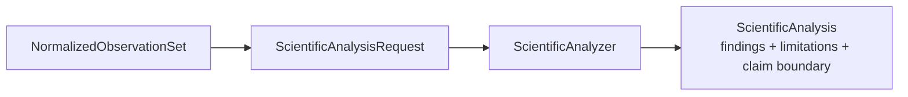

# `ksdft2effmass.analysis` package

## Responsibility

`ksdft2effmass.analysis` owns deterministic interpretation of normalized observations. It owns algorithms, units, tolerances, numerical policy, findings, analysis versions, and explicit claim boundaries. It does not execute calculators or decide scientific acceptance.

## Pages

- [Scientific analysis](analysis.md)

`NormalizedObservationSet` is calculator-independent and workflow-owned. Analysis implementations may import workflows, periodic, and Kohn–Sham contracts, but never calculator packages. Human-reviewed conclusions remain in research records citing exact analysis identities and provenance; Architecture v2 defines no software disposition or acceptance subsystem.

## Deferred implementation details

- Analysis package subdivision by scientific domain.
- Shared numerical-policy representation across analyzers.
- Whether analyzers operate on immutable in-memory records, artifact references, or both.
- Public registration and composition mechanism; mutable registries remain forbidden.
