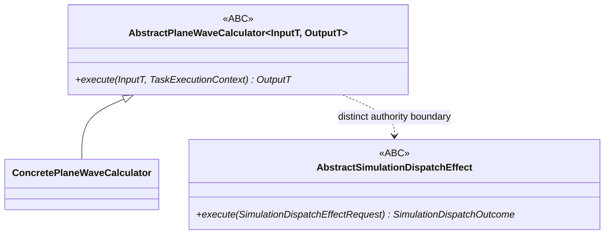

# `AbstractPlaneWaveCalculator` schematic

Nominal calculator membership supplies no external-effect authority. The two abstract
contracts are not interchangeable merely because both may use an `execute` name.
