# `ksdft2effmass.calculators` package

## Responsibility

```mermaid
flowchart LR
    activation["TaskActivation"] --> control["Workflow-control authority check"]
    exact_input["Exact calculator input and explicit context"] --> control
    control --> unit["Validated successor + exact grant reservation + dispatch obligation"]
    unit --> repository["WorkflowRunRepository atomic complete-unit commit"]
    repository --> executor_check["Independent executor-boundary authority check"]
    executor_check --> adapter["Injected integration executor"]
    adapter --> effect["Calculator-specific bounded process effect"]
    effect --> result["Concrete immutable ResultObject"]
    result --> outcome["SimulationDispatchOutcome envelope"]
    outcome --> ingress["TaskResultIngester admission"]
    ingress --> repository
    ingress --> parser["Integration-owned native parsers and semantic adapter"]
    parser --> observations["Workflow-owned NormalizedObservationSet"]
```

`ksdft2effmass.calculators` owns project-facing calculator-specific Simulation composites and Tasks, immutable exact input/output meaning, executable configuration, process request/observation records, and consumer-owned structural executor protocols. Concrete external-system serialization, staging, workspace/process invocation, native parsing, artifact discovery, failure mapping, and calculator-to-neutral adaptation belong to `ksdft2effmass.integration.<external-system>`. It depends on workflow contracts; `ksdft2effmass.workflows` does not import calculator packages.

Calculator-facing Task/input/output meaning, concrete integration execution and parsing, neutral-record invariants, workflow aggregation, and scientific analysis have separate owners.

## Shared contracts

| Object | Responsibility |
|---|---|
| `Simulation` | Workflow-facing structural protocol implemented by concrete calculator composites |
| `SimulationTask` | Structural Task specialization for invoking a Simulation composite with an explicitly injected executor implementation |
| `CalculatorFamilyIdentity` | Stable calculator family identity |
| `ExecutableIdentity` | Exact executable, version, and content identity |
| `ExecutionEnvironment` | Sanitized explicit environment and resource limits |
| `ProcessRequest` | Project-required command, exact input, attempt, authority, and output expectations consumed by a concrete integration |
| `ProcessObservation` | Exit status, timing, resource use, completion markers, and stream artifacts |
| Calculator output | Immutable workflow-facing `ResultObject` with exact mechanical artifact and provenance identities |
| `CalculatorFailureRecord` | Phase-specific configuration, dispatch, process, completion, or capture failure |

These records do not form a universal electronic-structure calculator base. Each calculator owns its demonstrated exact input, executor, output, and mechanical contracts. A runtime plugin registry or generic scientific tag dictionary is not part of this boundary.

## Explicit execution boundary

Workflow control checks the exact unused grant, TaskActivation, explicit execution context, exact input artifacts, executable configuration, and resource ceiling. `SimulationExecutionRequest` binds the exact Task instance, TaskActivation, attempt, executor, already-bound ResultObject inputs, grant, and obligation scope without embedding a generic Simulation aggregate. Workflow control then constructs the complete request/attempt/successor/grant-reservation/dispatch-obligation unit for atomic repository commit. The repository commits only that supplied unit and neither chooses a start gate nor invokes a Task.

Immediately before the process effect, the concrete integration implementation of the calculator-owned target-first executor protocol independently requires an exact `authorized` `SimulationExecutionAuthorizationResult` for the same reserved grant, verified authority snapshot, context, exact inputs, configuration, and limits. It then performs one expected-revision compare-and-swap claim from `reserved` to `claimed`; only the successful claimant executes. Missing, stale, mismatched, revoked, consumed, out-of-scope, unverifiable, duplicate, or losing inputs cause no execution. One grant covers one exact dispatch; retry or a new attempt requires new activation, operation, request, attempt, obligation, and grant identities.

`SimulationDispatchAdapter` owns dispatch orchestration and the closed confirmed, rejected, or indeterminate `SimulationDispatchOutcome` envelope. The effect-free `ColoredPetriNetWorkflowAdapter` owns only gate/value mapping, discriminated TaskActivation construction, confirmed returned-ResultObject mapping, and pure-firing composition. The calculator package owns the executor protocol and immutable result meaning; the injected integration implementation owns the bounded external effect and returns that concrete immutable ResultObject. Confirmed dispatch carries that exact returned object and correlations rather than creating a second result object. Indeterminate work retains its original identities and is not automatically redispatched. `TaskResultIngester` and explicit extraction specifications remain workflow-owned; calculator-produced files are not republished by result ingress. After reconciliation, workflow control constructs the corresponding candidate generic `TaskInvocationOutcome`. For confirmed work, `TaskResultIngester` validates its correlation to the specialized envelope and atomically admits the concrete result with the generic outcome and result transition; rejected or indeterminate generic outcomes reference their exact specialized outcome without results.

## Exact inputs and claims

Existing native inputs and pseudopotential artifacts remain usable under their actual content identities and provenance without rendering, conversion, registration, rerun, or evidence reclassification. Shared labels, nominal methods, elements, cutoffs, pseudopotential families/assets, or settings do not establish equivalence. Any equivalence assertion requires a separately authorized evidence-bearing comparison or validation claim.

## Pages

- [Quantum ESPRESSO](quantum-espresso.md)

## Deferred implementation details

- Whether demonstrated repeated integrations eventually justify an additional calculator-independent process protocol beyond existing project-owned request/observation records.
- Remote and scheduler adapter contracts.
- Standard resource-observation vocabulary.
- Exact public field and wire contracts.
