# `ksdft2effmass.calculators` package

## Responsibility

```mermaid
flowchart LR
    activation["TaskActivation"] --> control["Workflow-control authority check"]
    exact_input["Exact calculator input and explicit context"] --> control
    control --> unit["Validated successor + exact grant reservation + dispatch obligation"]
    unit --> repository["WorkflowRunRepository atomic complete-unit commit"]
    repository --> executor_check["Independent executor-boundary authority check"]
    executor_check --> adapter["Injected integration executor"]
    adapter --> effect["Calculator-specific bounded process effect"]
    effect --> result["Concrete immutable ResultObject"]
    result --> outcome["SimulationDispatchOutcome envelope"]
    outcome --> ingress["TaskResultIngester admission"]
    ingress --> repository
    ingress --> parser["Integration-owned native parsers and semantic adapter"]
    parser --> observations["Workflow-owned NormalizedObservationSet"]
```

`ksdft2effmass.calculators` owns backend-neutral calculator vocabularies and narrow
structural ports. Its canonical plane-wave DFT surface is
`ksdft2effmass.calculators.dft.pw`; the `pw` segment means the plane-wave method, not
Quantum ESPRESSO's `pw.x` executable. Shared fields are limited to concepts with
demonstrated calculator-independent meaning and do not form a universal native input,
executor, electronic-structure base class, or plugin registry. External-system input,
output, executable, diagnostic, artifact, and concrete execution meaning belongs to
`ksdft2effmass.integration.<external_system>`. Integrations may depend inward on
calculator and Workflow contracts; neither generic package imports an integration.

Backend-neutral calculator meaning, concrete integration execution and parsing,
neutral-record invariants, workflow aggregation, and scientific analysis have separate
owners. The accepted
[plane-wave DFT and QE package-ownership decision](quantum-espresso-package-ownership-decision.md)
places every QE-specific contract and implementation in
`ksdft2effmass.integration.quantum_espresso`.

## Shared contracts

| Object | Responsibility |
|---|---|
| `PlaneWaveCalculator` | Runtime-checkable structural port parameterized by exact integration-owned input and output types; conformance supplies no authority or registry |
| `PlaneWaveSimulationSpecification` | Compact portable candidate containing exact physical-branch identity, wavefunction cutoff, and observation requirements |
| `PlaneWaveBackendSupplement` | Reference to one exact integration-owned typed native supplement |
| `PlaneWaveBackendBinding` | Complete portable specification plus exact selected backend supplement |
| `PlaneWaveBackendCompilationCompiled` / `PlaneWaveBackendCompilationFailure` | Closed successful or fail-closed binding result without partial plans; every failure code has one exact matching failure outcome |

These records do not form a universal electronic-structure calculator base. The shared
[plane-wave QoI and parameter-study architecture](../plane-wave-parameter-studies.md)
describes portable scientific and numerical concepts while every integration retains
its exact native supplement, input, output, diagnostic, artifact, and mechanical
contracts. The prospective [QoI-first LAMMPS integration](../qoi-first-lammps-integration.md)
extends the same separation: analysis defines QoI meaning first, calculators own only
demonstrated backend-neutral atomistic requirements and bindings, and
`integration.lammps` owns every LAMMPS-native contract. Exact atomistic public names
remain deferred until a concrete project QoI demonstrates them. A runtime plugin
registry or generic scientific tag dictionary is not part of this boundary.

## Initial private SCF-to-bands slice

The human-selected [DFT simulation CPN service decision](../workflows/dft-simulation-cpn-service-decision.md)
introduced a private `_dft` probe with concrete QE and ABINIT records and a private
`DftCalculator` port. That bounded probe established early architecture evidence but
was never a supported package surface. The later package-ownership decision
superseded it as a placement precedent: backend-neutral contracts belong in `dft.pw`,
while calculator-native records belong to their respective integrations.

The private probe remains temporarily importable only because the maintained paired
QE/ABINIT tutorial example still consumes it. Its intrinsic checks now belong to the
owning records and its tests use explicit artifact-owned classes, but these strict
conformance corrections do not promote the probe. Retirement requires a separately
scoped migration or retirement of that remaining consumer. The calculator package
root deliberately exports no compatibility aliases.

## Contract-verification coverage

The maintained software-verification evidence separates the aggregate requirements:

| Requirement | Evidence owner |
|---|---|
| Exact supported plane-wave exports and private-probe containment | `SV-CALCULATOR-VERIFY-006`--`007` |
| Strictly owned private paired-example input/output probe | `SV-CALCULATOR-PRIVATE-001`--`004` and `SV-DFT-NSCF-DOS-001`--`006` |
| Backend-neutral structural calculator-port behavior | `SV-PLANE-WAVE-CALCULATOR-001`--`002` |
| Portable specification, native supplement, and exact binding composition | `SV-PLANE-WAVE-STUDY-007` |
| Closed successful result and exact failure outcome/code association | `SV-CALCULATOR-VERIFY-001`--`005` |
| QE-owned exact input, predecessor, output, and Workflow correlations through the generic port | `SV-QE-TASK-001`--`008` and `SV-QE-SIM-001`--`005` |
| Inward calculator/Workflow/integration dependency direction | `SV-QE-INTEGRATION-VERIFY-001`--`002` |

These are software-verification claims only. They perform no calculator process
effect and establish no numerical verification, backend equivalence, convergence,
scientific validation, uncertainty quantification, or human acceptance.

## Explicit execution boundary

Workflow control checks the exact unused grant, TaskActivation, explicit execution context, exact input artifacts, executable configuration, and resource ceiling. `SimulationExecutionRequest` binds the exact Task instance, TaskActivation, attempt, executor, already-bound ResultObject inputs, grant, and obligation scope without embedding a generic Simulation aggregate. Workflow control then constructs the complete request/attempt/successor/grant-reservation/dispatch-obligation unit for atomic repository commit. The repository commits only that supplied unit and neither chooses a start gate nor invokes a Task.

Immediately before the process effect, the concrete integration implementation of the
backend-neutral target-first plane-wave executor protocol independently requires an
exact `authorized` `SimulationExecutionAuthorizationResult` for the same reserved
grant, verified authority snapshot, context, exact native integration input,
configuration, and limits. It then performs one expected-revision compare-and-swap
claim from `reserved` to `claimed`; only the successful claimant executes. Missing,
stale, mismatched, revoked, consumed, out-of-scope, unverifiable, duplicate, or losing
inputs cause no execution. One grant covers one exact dispatch; retry or a new attempt
requires new activation, operation, request, attempt, obligation, and grant identities.

`SimulationDispatchAdapter` owns dispatch orchestration and the closed confirmed, rejected, or indeterminate `SimulationDispatchOutcome` envelope. The effect-free `ColoredPetriNetWorkflowAdapter` owns only gate/value mapping, discriminated TaskActivation construction, confirmed returned-ResultObject mapping, and pure-firing composition. The calculator package owns the backend-neutral executor port; the injected integration owns concrete native input and immutable result meaning, the bounded external effect, and the returned concrete ResultObject. Confirmed dispatch carries that exact returned object and correlations rather than creating a second result object. Indeterminate work retains its original identities and is not automatically redispatched. `TaskResultIngester` and explicit extraction specifications remain workflow-owned; calculator-produced files are not republished by result ingress. After reconciliation, workflow control constructs the corresponding candidate generic `TaskInvocationOutcome`. For confirmed work, `TaskResultIngester` validates its correlation to the specialized envelope and atomically admits the concrete result with the generic outcome and result transition; rejected or indeterminate generic outcomes reference their exact specialized outcome without results.

## Exact inputs and claims

Existing native inputs and pseudopotential artifacts remain usable under their actual content identities and provenance without rendering, conversion, registration, rerun, or evidence reclassification. Shared labels, nominal methods, elements, cutoffs, pseudopotential families/assets, or settings do not establish equivalence. Any equivalence assertion requires a separately authorized evidence-bearing comparison or validation claim.

## Pages

- [Plane-wave QoIs and parameter studies](../plane-wave-parameter-studies.md)
- [QoI-first calculator integration and LAMMPS](../qoi-first-lammps-integration.md)
- [Quantum ESPRESSO](quantum-espresso.md)
- [Plane-wave DFT and QE package ownership](quantum-espresso-package-ownership-decision.md)
- [QE task-contract boundary decision](quantum-espresso-task-contract-boundary-decision.md)

## Deferred implementation details

- Whether a concrete LAMMPS use case demonstrates a stable backend-neutral atomistic
  subpackage and structural calculator port.
- Whether demonstrated repeated integrations eventually justify an additional calculator-independent process protocol beyond existing project-owned request/observation records.
- Remote and scheduler adapter contracts.
- Standard resource-observation vocabulary.
- Exact public serialization and wire contracts.
