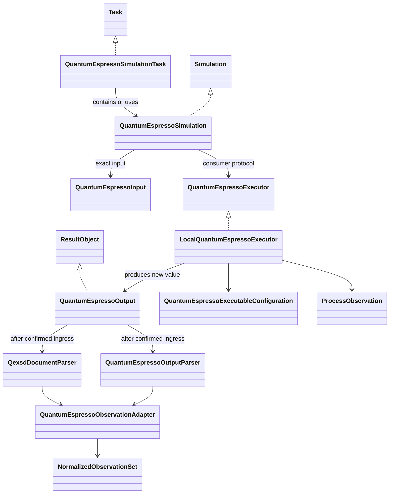

# Quantum ESPRESSO calculator architecture

## Object model

## Roles

| Object | Responsibility |
|---|---|
| `QuantumEspressoSimulationTask` | Concrete Task that contains or uses the QE Simulation composite |
| `QuantumEspressoSimulation` | Concrete structural Simulation composite of input, executor, and produced output roles |
| `QuantumEspressoInput` | Immutable DataObject containing or referencing exact native QE input and exact pseudopotential/artifact identities and provenance |
| `QuantumEspressoExecutor` | Calculator-owned consumer structural protocol for the target-first execution operation and returned `QuantumEspressoOutput` |
| `LocalQuantumEspressoExecutor` | Integration-owned concrete external-effect ActionObject consuming exact input and accepted explicit context after authority/dispatch gates |
| `QuantumEspressoOutput` | New immutable ResultObject carrying mechanical output, artifact, correlation, and provenance identities without convergence or acceptance claims |
| `QuantumEspressoExecutableConfiguration` | Exact program, executable identity, supported version, invocation, and resource policy |
| `ProcessObservation` | Mechanical exit status, timing, resource use, completion markers, and stream artifacts |

`QuantumEspressoSimulation` is the selected concrete input/executor/output composite. The executor role is the calculator-owned `QuantumEspressoExecutor` protocol; application composition injects `ksdft2effmass.integration.quantumespresso.LocalQuantumEspressoExecutor` or another separately selected conforming concrete integration. Actual output is returned as a new value and correlated in `WorkflowRun` Task result state; no pre-execution object is mutated. This consumer-owned port is not a runtime plugin registry or generic backend hierarchy.

## ActionObjects

| ActionObject | Operation |
|---|---|
| `QuantumEspressoExecutor` protocol | Exact `QuantumEspressoInput` plus accepted explicit execution context → new `QuantumEspressoOutput`, or a represented failure/outcome at the dispatch boundary |
| `LocalQuantumEspressoExecutor` | Concrete isolated-workspace and local-process implementation of the executor protocol; owned by `ksdft2effmass.integration.quantumespresso` |
| `QuantumEspressoInputStager` | Exact retained native bytes and exact artifacts → verified staged input without mandatory rendering; integration-owned |
| `QuantumEspressoInputSerializer` | Accepted calculator-owned input record → deterministic QE-native input bytes; integration-owned |
| `QuantumEspressoOutputParser` | Native stdout bytes → mechanically faithful native record or `NativeParsingFailure`; integration-owned |
| `QexsdDocumentParser` | QEXSD bytes → mechanically faithful record or `NativeParsingFailure`; integration-owned |
| `QuantumEspressoObservationAdapter` | Exact native records plus explicit normalization policy/version → neutral observations and workflow-owned `NormalizedObservationSet`, or `ObservationNormalizationFailure`; integration-owned |
| `QuantumEspressoArtifactCollector` | Native process outputs → verified calculator-specific candidates for workflow publication; integration-owned |

## Execution path

```mermaid
flowchart LR
    selection["Direct, any_of, or all_of activation selection"] --> activation["TaskActivation<br/>QuantumEspressoSimulationTask"]
    qe_input["Exact QuantumEspressoInput<br/>native bytes + pseudopotentials"] --> control["Workflow-control authority check"]
    activation --> control
    control --> unit["Request + attempt + successor<br/>grant reservation + obligation"]
    unit --> commit["WorkflowRunRepository atomic commit"]
    commit --> executor_check["Independent executor-boundary authority check"]
    executor_check --> executor["Injected integration implementation<br/>of QuantumEspressoExecutor"]
    executor --> stage["Integration-owned QuantumEspressoInputStager"]
    stage --> effect["Bounded pw.x process effect"]
    effect --> output["New immutable QuantumEspressoOutput"]
    output --> reconcile["SimulationDispatchOutcome<br/>confirmed/rejected/indeterminate envelope"]
    reconcile --> ingress["TaskResultIngester<br/>confirmed QuantumEspressoOutput admission"]
    ingress --> commit
    ingress --> parsers["Integration-owned QuantumEspressoOutputParser<br/>and/or QexsdDocumentParser"]
    parsers --> adapter["Integration-owned QuantumEspressoObservationAdapter"]
    adapter --> normalized["NormalizedObservationSet"]
```

Workflow control and the executor boundary independently run `SimulationExecutionAuthorizer` over the same exact grant, verified authority snapshot, Task-instance/TaskActivation/request/context, executor, already-bound ResultObject inputs, QE input, pseudopotential closure, executable configuration, attempt identity, dispatch obligation, artifact destinations, and resource ceiling. The closed result is `authorized`, `denied`, or `error`; only the exact `authorized` result may continue. Any missing, stale, mismatched, revoked, consumed, out-of-scope, or unverifiable input causes no reservation, claim, or execution as applicable. The repository creates no authority and invokes no Task.

One grant authorizes one exact dispatch. The request transaction reserves it to one obligation, and immediately before `QuantumEspressoExecutor` invocation one expected-revision compare-and-swap claim changes `reserved` to `claimed`. Only the successful claimant proceeds; claimed authority is never reusable, and a duplicate or indeterminate claimant does not execute. Retry uses new activation, operation, request, attempt, obligation, and grant identities. `QuantumEspressoSimulationTask` returns concrete immutable `QuantumEspressoOutput`. Confirmed `SimulationDispatchOutcome` is an envelope containing that exact output and correlation identities, not a second scientific result object. Rejected and indeterminate outcomes contain no invented output; indeterminate work retains its existing identities and cannot be automatically redispatched. After reconciliation, workflow control constructs the candidate generic `TaskInvocationOutcome`. For confirmed work, `TaskResultIngester` validates its correlation to the specialized envelope and atomically admits the output with the generic outcome and result transition; rejected or indeterminate generic outcomes reference the exact matching dispatch outcome without results. Publication consumes only committed obligations.

## Exact artifacts and non-equivalence

Existing exact QE input bytes and pseudopotential artifacts remain usable with their actual identities and producer provenance without rerun, rendering, conversion, registration, fabricated Task lineage, or evidence reclassification. External, imported retained, human-authored, and bounded legacy variants remain distinct.

Same labels, nominal methods, elements, cutoffs, pseudopotential families/assets, or settings across implementations do not establish equivalence. PAW, ultrasoft, and norm-conserving assets; valence/core choices; generation settings; exchange-correlation compatibility; relativistic treatment; projector construction; recommended cutoffs; and formats remain exact represented inputs. Equivalence requires a separate evidence-bearing comparison or validation claim.

## Package dependencies and status

Project-facing QE Task, Simulation, immutable input/output, executable-configuration, process-record, and executor-protocol types remain under `ksdft2effmass.calculators`. Concrete QE serialization, staging, workspace/process invocation, artifact discovery, native parsing, failure mapping, and observation adaptation belong to `ksdft2effmass.integration.quantumespresso`, which depends on calculator and narrow project-owned contracts. Application composition imports both and injects the concrete executor. Calculators, workflows, and neutral domains never import the integration package. No prospective `ksdft2effmass.io.quantum_espresso` owner remains.

Supported QE operations, field and wire contracts, structured rendering, scheduler adapters, and version policy remain deferred. This documentation grants no protected execution and claims no implementation, software or numerical verification, convergence, scientific validation, uncertainty quantification, equivalence, recalculation, or human software acceptance.
