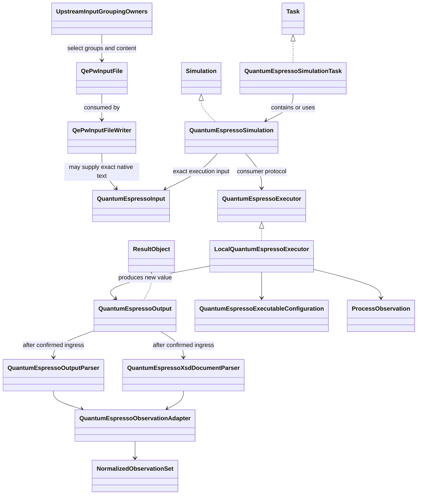

# Quantum ESPRESSO calculator architecture

## Object model

## Roles

| Object | Responsibility |
|---|---|
| `QuantumEspressoSimulationTask` | Prospective concrete Task that contains or uses the QE Simulation composite |
| `QuantumEspressoSimulation` | Prospective concrete structural Simulation composite of input, executor, and produced output roles |
| `QePwInputFile` | Implemented integration-owned immutable DataObject preserving upstream-selected ordered grouping tags and opaque body lines; owns no variable catalog, scientific default, artifact identity, or provenance schema |
| `QePwInputFileWriter` | Implemented integration-owned ActionObject adding only deterministic QE namelist/card syntax to a `QePwInputFile` and returning text |
| `QuantumEspressoInput` | Prospective calculator-owned execution envelope containing or referencing exact native QE input plus separately owned pseudopotential/artifact identities and provenance; it does not determine `QePwInputFile` grouping content |
| `QuantumEspressoExecutor` | Prospective calculator-owned consumer structural protocol for the target-first execution operation and returned `QuantumEspressoOutput` |
| `LocalQuantumEspressoExecutor` | Prospective integration-owned concrete external-effect ActionObject consuming exact input and accepted explicit context after authority/dispatch gates |
| `QuantumEspressoOutput` | Prospective immutable ResultObject carrying mechanical output, artifact, correlation, and provenance identities without convergence or acceptance claims |
| `QuantumEspressoExecutableConfiguration` | Prospective exact program, executable identity, supported version, invocation, and resource policy |
| `ProcessObservation` | Prospective mechanical exit status, timing, resource use, completion markers, and stream artifacts |

The current implementation stops at `QePwInputFileWriter`. Upstream domain and workflow objects choose all groups, tags, assignments, lexical values, card options, rows, and ordering. The loose input object and writer do not define a comprehensive QE semantic model and do not bundle provenance.

`QuantumEspressoSimulation` is the prospective concrete input/executor/output composite. Its `QuantumEspressoInput` may consume written text from `QePwInputFileWriter` or reference independently retained exact native bytes; it does not become the owner of input grouping policy. The executor role is the calculator-owned `QuantumEspressoExecutor` protocol; application composition injects `ksdft2effmass.integration.quantumespresso.LocalQuantumEspressoExecutor` or another separately selected conforming concrete integration. Actual output is returned as a new value and correlated in `WorkflowRun` Task result state; no pre-execution object is mutated. This consumer-owned port is not a runtime plugin registry or generic backend hierarchy.

## ActionObjects

| ActionObject | Operation |
|---|---|
| `QePwInputFileWriter` | Implemented ordered opaque QE groups → deterministic `pw.x` input text; integration-owned and independent of execution |
| `QuantumEspressoExecutor` protocol | Prospective exact `QuantumEspressoInput` plus accepted explicit execution context → new `QuantumEspressoOutput`, or a represented failure/outcome at the dispatch boundary |
| `LocalQuantumEspressoExecutor` | Prospective concrete isolated-workspace and local-process implementation of the executor protocol; integration-owned |
| `QuantumEspressoInputStager` | Prospective exact retained native bytes and exact artifacts → verified staged input without mandatory rendering; integration-owned |
| `QuantumEspressoOutputParser` | Prospective native stdout bytes → mechanically faithful native record or `NativeParsingFailure`; integration-owned |
| `QuantumEspressoXsdDocumentParser` | Implemented explicit QEXSD bytes → mechanically faithful native record; downstream and integration-owned |
| `QuantumEspressoObservationAdapter` | Prospective exact native records plus explicit normalization policy/version → neutral observations and workflow-owned `NormalizedObservationSet`, or `ObservationNormalizationFailure`; integration-owned |
| `QuantumEspressoArtifactCollector` | Prospective native process outputs → verified calculator-specific candidates for workflow publication; integration-owned |

`QePwInputFileWriter` replaces the earlier proposed comprehensive
`QuantumEspressoInputSerializer` at the implemented writing boundary. A future stager
may encode or consume its text, but may not move upstream grouping or scientific
policy into the writer.

## Prospective execution path

```mermaid
flowchart LR
    selection["Direct, any_of, or all_of activation selection"] --> activation["TaskActivation<br/>QuantumEspressoSimulationTask"]
    grouped["Upstream-selected QePwInputFile"] --> writer["QePwInputFileWriter"]
    writer --> qe_input["Prospective exact QuantumEspressoInput<br/>native text/bytes + separately owned artifacts"]
    retained["Independently retained exact input bytes"] --> qe_input
    qe_input --> control["Workflow-control authority check"]
    activation --> control
    control --> unit["Request + attempt + successor<br/>grant reservation + obligation"]
    unit --> commit["WorkflowRunRepository atomic commit"]
    commit --> executor_check["Independent executor-boundary authority check"]
    executor_check --> executor["Injected integration implementation<br/>of QuantumEspressoExecutor"]
    executor --> stage["Integration-owned QuantumEspressoInputStager"]
    stage --> effect["Bounded pw.x process effect"]
    effect --> output["New immutable QuantumEspressoOutput"]
    output --> reconcile["SimulationDispatchOutcome<br/>confirmed/rejected/indeterminate envelope"]
    reconcile --> ingress["TaskResultIngester<br/>confirmed QuantumEspressoOutput admission"]
    ingress --> commit
    ingress --> parsers["Downstream integration-owned QuantumEspressoOutputParser<br/>and/or QuantumEspressoXsdDocumentParser"]
    parsers --> adapter["Integration-owned QuantumEspressoObservationAdapter"]
    adapter --> normalized["NormalizedObservationSet"]
```

Workflow control and the executor boundary independently run `SimulationExecutionAuthorizer` over the same exact grant, verified authority snapshot, Task-instance/TaskActivation/request/context, executor, already-bound ResultObject inputs, QE input, pseudopotential closure, executable configuration, attempt identity, dispatch obligation, artifact destinations, and resource ceiling. The closed result is `authorized`, `denied`, or `error`; only the exact `authorized` result may continue. Any missing, stale, mismatched, revoked, consumed, out-of-scope, or unverifiable input causes no reservation, claim, or execution as applicable. The repository creates no authority and invokes no Task.

One grant authorizes one exact dispatch. The request transaction reserves it to one obligation, and immediately before `QuantumEspressoExecutor` invocation one expected-revision compare-and-swap claim changes `reserved` to `claimed`. Only the successful claimant proceeds; claimed authority is never reusable, and a duplicate or indeterminate claimant does not execute. Retry uses new activation, operation, request, attempt, obligation, and grant identities. `QuantumEspressoSimulationTask` returns concrete immutable `QuantumEspressoOutput`. Confirmed `SimulationDispatchOutcome` is an envelope containing that exact output and correlation identities, not a second scientific result object. Rejected and indeterminate outcomes contain no invented output; indeterminate work retains its existing identities and cannot be automatically redispatched. After reconciliation, workflow control constructs the candidate generic `TaskInvocationOutcome`. For confirmed work, `TaskResultIngester` validates its correlation to the specialized envelope and atomically admits the output with the generic outcome and result transition; rejected or indeterminate generic outcomes reference the exact matching dispatch outcome without results. Publication consumes only committed obligations.

## Exact artifacts and non-equivalence

`QePwInputFile` and `QePwInputFileWriter` carry no provenance schema. Existing exact QE input bytes and pseudopotential artifacts remain usable with their actual identities and producer provenance without rerun, rendering, conversion, registration, fabricated Task lineage, or evidence reclassification. External, imported retained, human-authored, and bounded legacy variants remain distinct.

Same labels, nominal methods, elements, cutoffs, pseudopotential families/assets, or settings across implementations do not establish equivalence. PAW, ultrasoft, and norm-conserving assets; valence/core choices; generation settings; exchange-correlation compatibility; relativistic treatment; projector construction; recommended cutoffs; and formats remain exact represented inputs. Equivalence requires a separate evidence-bearing comparison or validation claim.

## Package dependencies and status

The implemented `QePwInputFile` and `QePwInputFileWriter` live under `ksdft2effmass.integration.quantumespresso` and depend on no calculator execution model. Project-facing QE Task, Simulation, execution input/output, executable-configuration, process-record, and executor-protocol types remain prospective under `ksdft2effmass.calculators`. Concrete staging, workspace/process invocation, artifact discovery, native parsing, failure mapping, and observation adaptation remain integration responsibilities that may depend on calculator and narrow project-owned contracts. Application composition imports both and injects any future concrete executor. Calculators, workflows, and neutral domains never import the integration package. The existing `ksdft2effmass.io.quantum_espresso.qexsd` path is legacy; it is not the prospective owner.

Supported QE operations, comprehensive variable models, field and wire contracts, scheduler adapters, and version policy remain deferred. QEXSD parsing remains an output-side capability and does not define the input integration architecture.
