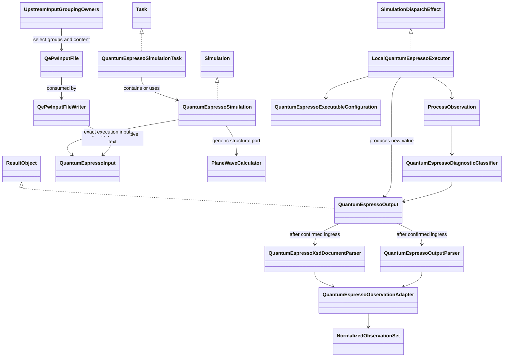

# Quantum ESPRESSO integration architecture

The accepted
[package-ownership decision](quantum-espresso-package-ownership-decision.md) places
backend-neutral plane-wave DFT contracts in `ksdft2effmass.calculators.dft.pw` and all
QE-specific contracts and behavior in
`ksdft2effmass.integration.quantum_espresso`. The accepted
[task-contract boundary decision](quantum-espresso-task-contract-boundary-decision.md)
selects operation-specific SCF, NSCF, band-path, and bands-extraction Task contracts;
DOS remains deferred. Names on this page denote QE integration roles unless explicitly
identified as generic plane-wave or Workflow contracts. The selected Task adapters
remain unimplemented until their dependent child Task is separately activated.

## Object model

## Roles

| Object | Responsibility |
|---|---|
| `QuantumEspressoSimulationTask` | Prospective integration-owned concrete Task adapter that contains or uses the QE Simulation composite while satisfying the applicable generic plane-wave Task protocol |
| `QuantumEspressoSimulation` | Prospective integration-owned concrete structural Simulation composite of input, executor, and produced output roles |
| `QePwInputFile` | Implemented integration-owned immutable DataObject preserving upstream-selected ordered grouping tags and opaque body lines; owns no variable catalog, scientific default, artifact identity, or provenance schema |
| `QePwInputFileWriter` | Implemented integration-owned ActionObject adding only deterministic QE namelist/card syntax to a `QePwInputFile` and returning text |
| `QuantumEspressoExecutionInput` | Implemented integration-owned immutable execution input referencing exact native QE input, pseudopotential, and predecessor-state content identities; it does not determine `QePwInputFile` grouping content |
| `PlaneWaveCalculator` | Implemented `ksdft2effmass.calculators.dft.pw` structural port parameterized by application composition; it grants no execution authority and is not the Workflow dispatch-effect port |
| `LocalQuantumEspressoExecutor` | Implemented integration-owned target-first external-effect ActionObject satisfying Workflow `SimulationDispatchEffect`; it validates an exact entered dispatch and composes one local attempt |
| `QuantumEspressoPwResult` and `QuantumEspressoBandsResult` | Implemented integration-owned immutable ResultObjects carrying mechanical process, diagnostic, artifact, outcome, terminal, and producer correlations without convergence or acceptance claims |
| `QuantumEspressoExecutableConfiguration` | Implemented integration-owned exact QE program role, executable identity, supported version, invocation, and classifier binding |
| QE process observation | Integration-owned concrete observation retaining exact executable binding, termination, independent stdout/stderr, workspace snapshots, and native-artifact supplements |
| `QuantumEspressoDiagnosticClassifier` | Implemented integration-owned ActionObject mapping exact calculator-defined diagnostic channels under explicit executable, program-version, and classifier-version identities to closed native diagnostic observations without scientific acceptance claims |

The canonical package is
`ksdft2effmass.integration.quantum_espresso`. It now implements exact execution input,
local preparation/staging/process observation, fixture-bound diagnostic
classification, native-output candidate collection, closed calculator outcomes,
private terminal publication, program-specific ResultObjects, and Workflow dispatch
adaptation. Upstream domain and workflow objects still choose all scientific groups,
tags, assignments, lexical values, card options, rows, and ordering. The loose input
object and writer do not define a comprehensive QE semantic model or bundle
provenance, and real-QE diagnostic signatures remain deferred.

`QuantumEspressoSimulation` remains a prospective application composite. Its
implemented `QuantumEspressoExecutionInput` may reference written text from
`QePwInputFileWriter` or independently retained exact native bytes; it does not become
the owner of input grouping policy. Application composition may bind QE-specific
input and output types to the backend-neutral `PlaneWaveCalculator` port, while the
implemented authority-bearing runtime ingress is the separate Workflow
`SimulationDispatchEffect` satisfied by `LocalQuantumEspressoExecutor`. Actual output
is returned as a new value and correlated in `WorkflowRun` Task result state; no
pre-execution object is mutated. Structural conformance introduces no runtime plugin
registry, generic backend hierarchy, or calculator-owned QE facade.

## ActionObjects

| ActionObject | Operation |
|---|---|
| `QePwInputFileWriter` | Implemented ordered opaque QE groups → deterministic `pw.x` input text; integration-owned and independent of execution |
| `PlaneWaveCalculator` | Implemented backend-neutral structural port under `ksdft2effmass.calculators.dft.pw`; its type parameters are bound by application composition and contain no QE policy |
| `LocalQuantumEspressoExecutor` | Implemented Workflow dispatch-effect ActionObject: exact entered dispatch plus one immutable plan → confirmed, rejected, or indeterminate `SimulationDispatchOutcome` |
| `QuantumEspressoInputStager` | Implemented exact retained native bytes and artifacts → verified no-replace staged input without mandatory rendering; integration-owned |
| `QuantumEspressoDiagnosticClassifier` | Implemented exact stdout/stderr plus explicit executable-kind, program-role, version, and classifier identities → closed known-nonblocking, known-fatal, contradictory, or unresolved native diagnostic observations for the deterministic fixture catalog; integration-owned |
| `QuantumEspressoOutputParser` | Prospective admitted native output artifacts → mechanically faithful native record or `NativeParsingFailure`; integration-owned and distinct from pre-result diagnostic classification |
| `QuantumEspressoXsdDocumentParser` | Implemented explicit QEXSD bytes → mechanically faithful native record; downstream and integration-owned |
| `QuantumEspressoObservationAdapter` | Prospective exact native records plus explicit normalization policy/version → neutral observations and workflow-owned `NormalizedObservationSet`, or `ObservationNormalizationFailure`; integration-owned |
| `QuantumEspressoArtifactCollector` | Prospective native process outputs → verified calculator-specific candidates for workflow publication; integration-owned |

`QePwInputFileWriter` replaces the earlier proposed comprehensive
`QuantumEspressoInputSerializer` at the implemented writing boundary. A future stager
may encode or consume its text, but may not move upstream grouping or scientific
policy into the writer.

## Implemented local execution path and deferred downstream adapters

```mermaid
flowchart LR
    selection["Direct, any_of, or all_of activation selection"] --> activation["TaskActivation<br/>QuantumEspressoSimulationTask"]
    grouped["Upstream-selected QePwInputFile"] --> writer["QePwInputFileWriter"]
    writer --> qe_input["Exact QuantumEspressoExecutionInput<br/>native content + separately owned artifacts"]
    retained["Independently retained exact input bytes"] --> qe_input
    qe_input --> control["Workflow-control authority check"]
    activation --> control
    control --> unit["Request + attempt + successor<br/>grant reservation + obligation"]
    unit --> commit["WorkflowRunRepository atomic commit"]
    commit --> executor_check["Independent executor-boundary authority check"]
    executor_check --> executor["LocalQuantumEspressoExecutor<br/>as Workflow SimulationDispatchEffect"]
    executor --> stage["Integration-owned QuantumEspressoInputStager"]
    stage --> effect["Bounded configured local process effect"]
    effect --> capture["Exact process observation<br/>independent stdout/stderr artifacts"]
    capture --> classify["Integration-owned version-bound<br/>diagnostic classification"]
    classify --> output["New immutable program-specific<br/>QE ResultObject"]
    output --> reconcile["SimulationDispatchOutcome<br/>confirmed/rejected/indeterminate envelope"]
    reconcile --> ingress["TaskResultIngester<br/>confirmed QuantumEspressoOutput admission"]
    ingress --> commit
    ingress --> parsers["Downstream integration-owned QuantumEspressoOutputParser<br/>and/or QuantumEspressoXsdDocumentParser"]
    parsers --> adapter["Integration-owned QuantumEspressoObservationAdapter"]
    adapter --> normalized["NormalizedObservationSet"]
```

Workflow control runs `SimulationExecutionAuthorizer` during preparation and again
immediately before claim. Only the exact authorized claim and the newly won durable
dispatch-entry compare-and-swap reach the effect port. The concrete executor does not
issue authority or rerun the authority service; before mutation it independently
matches the supplied authorized effect request against its immutable plan and exact
Task, activation, operation, attempt, executor, destination, resource, preparation
authorization, grant, obligation, dispatch-entry, outcome, and input identities. Any
mismatch returns a pre-process rejected dispatch. The repository creates no authority
and invokes no Task.

One grant authorizes one exact dispatch. The request transaction reserves it to one
obligation, and immediately before `LocalQuantumEspressoExecutor` invocation one
expected-revision compare-and-swap claim changes `reserved` to `claimed`. Only the
successful claimant proceeds; claimed authority is never reusable, and a duplicate or
indeterminate claimant does not execute. Retry uses new activation, operation,
request, attempt, obligation, and grant identities. The executor returns a concrete
immutable `QuantumEspressoPwResult` or `QuantumEspressoBandsResult` when process,
capture, classification, collection, and terminal publication are determinate.
Confirmed `SimulationDispatchOutcome` is an envelope containing that exact output and
correlation identities, not a second scientific result object. Rejected and
indeterminate outcomes contain no invented output; indeterminate work retains its
existing identities and cannot be automatically redispatched. After reconciliation,
workflow control constructs the candidate generic `TaskInvocationOutcome`. For
confirmed work, `TaskResultIngester` validates its correlation to the specialized
envelope and atomically admits the output with the generic outcome and result
transition; rejected or indeterminate generic outcomes reference the exact matching
dispatch outcome without results. Publication consumes only committed obligations.

The accepted [QE diagnostic outcome and retry decision](quantum-espresso-diagnostic-outcome-decision.md)
refines this path. Its initial private Python realization is fixed by the
[QE local-execution implementation contract](quantum-espresso-local-execution-contract.md).
A determinately captured QE calculator failure is a confirmed
dispatch containing an operation-specific typed ResultObject; confirmed means that
the effect and capture are known, not that the calculator succeeded. The result keeps
process termination, calculator-reported outcome, diagnostic disposition, artifact
availability, and native continuation state as separate facts. Known fatal,
contradictory, and unresolved diagnostic outcomes cannot satisfy a downstream Task
dependency. Spawn, confinement, identity, capture, and reconciliation failures remain
rejected or indeterminate dispatch outcomes as applicable.

Retry control belongs to the Workflow-owned CPN composition, not to the executor or
the effect-free generic CPN kernel. A failed or unresolved result enters an explicit
recovery branch. Only an admitted resolution may make reevaluation or retry eligible;
the latter requires new activation, operation, attempt, request, obligation, and
grant identities plus a fresh authority check before dispatch. Reclassification of
an otherwise completed retained result may instead re-evaluate admission without a QE
rerun. Prior attempts and resolutions remain immutable history, and every retry branch
has an explicit abandon or bounded-exhaustion path.

## Exact artifacts and non-equivalence

`QePwInputFile` and `QePwInputFileWriter` carry no provenance schema. Existing exact QE input bytes and pseudopotential artifacts remain usable with their actual identities and producer provenance without rerun, rendering, conversion, registration, fabricated Task lineage, or evidence reclassification. External, imported retained, human-authored, and bounded legacy variants remain distinct.

Same labels, nominal methods, elements, cutoffs, pseudopotential families/assets, or settings across implementations do not establish equivalence. PAW, ultrasoft, and norm-conserving assets; valence/core choices; generation settings; exchange-correlation compatibility; relativistic treatment; projector construction; recommended cutoffs; and formats remain exact represented inputs. Equivalence requires a separate evidence-bearing comparison or validation claim.

## Package dependencies and status

The canonical `QePwInputFile`, `QePwInputFileWriter`, QE Task/Simulation/input/output,
executable configuration, native process and diagnostic supplements, staging,
workspace/process invocation, artifact discovery, QEXSD parsing, failure mapping, and
observation adaptation belong under
`ksdft2effmass.integration.quantum_espresso`.
Backend-neutral plane-wave DFT records and structural ports belong under
`ksdft2effmass.calculators.dft.pw`. Application composition imports both generic and
integration packages and injects the concrete adapter. Calculator, Workflow, and
neutral domains never import the QE integration. The former
`ksdft2effmass.io.quantum_espresso.qexsd` path is removed.

The initial public QE execution exports are implemented. Comprehensive variable
models, accepted real-QE diagnostic signatures, public wire contracts, scheduler
adapters, retry bounds, and broad version policy remain deferred. The private
local-execution contract fixes the initial implementation fields plus private terminal
and workspace-snapshot record wires. The observed
floating-point stderr notice is not classified by this architecture. QEXSD parsing
remains an output-side capability and does not define the input integration
architecture.
