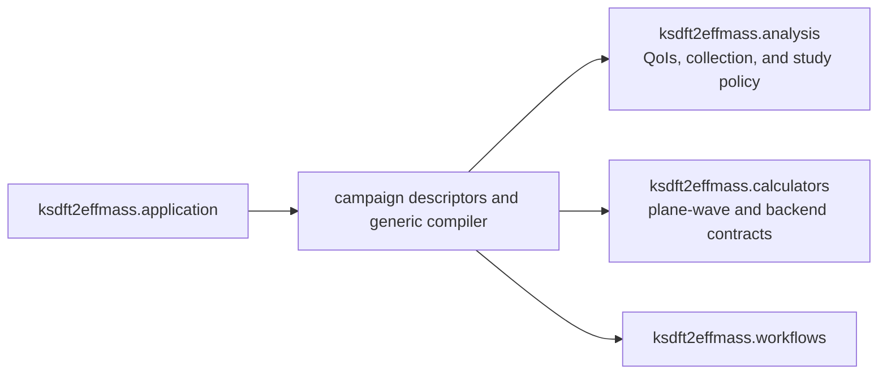

# `ksdft2effmass.campaigns` package

The `ksdft2effmass.campaigns` package owns project-specific composition definitions
that bind explicit selected inputs into analysis,
calculator, and Workflow contracts. It does not own generic Workflow or Petri-net
mechanics, calculator behavior, QoI semantics, parameter-study analysis, integration
execution, or scientific acceptance.

Under the selected [plane-wave QoI and parameter-study
architecture](../plane-wave-parameter-studies.md), a campaign may bind an exact
one or more ordered parameter-study revisions, typed role-specific
QoI-to-observation requirements, calculator/backend bindings, ungated run-scoped Task
instances, Workflow and CPN identities, and exact input identities. The generic
`PlaneWaveParameterStudyCompiler` deterministically produces ordered multi-Task
candidate branches, compiled all-of Task gates, a pure CPN, explicit dependencies,
an all-unique-branch collection Task, and a separately gated analysis Task. The
compiled plan retains the complete request.

Reuse is evaluated per Task role. Equal complete execution-defining content requires
the same run-scoped Task instance and produces an explicit candidate/canonical/role
reuse record; distinct content cannot share an instance. A logical candidate remains
in study and observation order even when every Task in its branch reuses a prior
candidate. Nominal identity equality, matching parameter labels, and equal numbers
are insufficient.

`BulkSiliconOptionADescriptor` is the maintained material-specific instantiation. It
contains exact retained compact-input identities, imported-fixture provenance, the
future external workspace root, complete Rydberg-to-electron-volt conversion
ResultObjects, six cutoff candidates, four mesh candidates, and C48/K8 reuse. It is
compiled by the generic compiler; there is no second bulk-specific compiler. Its
nine unique SCF-to-diagnostic-NSCF branches feed an analysis-owned typed observation
collection request and then separate analysis. The descriptor and compiler perform
no file access or scientific execution.

Campaign definitions and compilation do not activate protected execution, grant
authority, run adaptive algorithms, interpret scientific results, or establish
scientific acceptance. An adaptive refinement proposal must first become a validated
immutable successor study revision; any resulting Workflow is compiled separately.
The public `ksdft2effmass.campaigns.research_monograph` subpackage owns the first
supported campaign surfaces: exact harmonic-oscillator study composition and the
one-dimensional particle-in-a-box residual, convergence, higher-eigenpair, norm, and
identifiability studies with version-one retained-format adapters. The
`impurity_defect_2d` subpackage additionally owns execution-free finite-domain study,
case, inventory, deterministic enumeration, and version-one inventory-serialization
contracts. Shared isotropic geometries are emitted once with separate channel
memberships; orientation records retain three future evaluation roles. The compact
wire representation retains the definition and authenticates the full reconstructed
case content by SHA-256 while stating ``not_executed`` explicitly. The corresponding
planning Workflow composes validation, enumeration, and serialization only and binds
the exact inventory to canonical plan bytes. No operator construction or campaign
execution is owned by that enumerator, serializer, or planning Workflow. The same
subpackage publicly owns ``AdoptedCriteriaPlot`` and
``AdverseControlBarPlot`` as composable Matplotlib-axis renderers, together with
``StageCParentSvgPlotter`` for deterministic SVG composition from caller-supplied
retained scalar diagnostics. Each component accepts caller-supplied axes or creates
new axes when none are supplied. The plotters perform no parent calculation,
matrix-artifact read, validation, or UQ, and the SVG composer refuses to replace an
existing output. Historical Stage C CLI bytes remain immutable provenance artifacts;
new plotting uses a version-two CLI adapter that delegates to the public plotters.
Reusable observed-order analysis, spectral-subspace selection, operator compression,
represented-matrix norms, and finite-domain channel results remain below the campaign
layer.

The public `research_monograph.periodic_1d` surface owns the version-one isolated,
stress, and composite Appendix G campaign definitions and canonical serializers. Its
public `Periodic1DCampaignJsonDecoder` owns their shared closed JSON primitive
representations; serializers remain responsible for schema fields and versions.
Composite retained groups compose the reusable `ContiguousBandSelection` contract,
and stress shapes compose `PeriodicFourierPotential1D`. Public immutable JSON object
and array records preserve every value in the isolated, stress, composite, Wannier90,
preconditioned Wannier90, and convergence-attempt result formats. The retained-result
serializer keeps the source-byte SHA-256 identity separate from canonical output
bytes. The isolated-band result adapter additionally exposes typed parent convergence,
common-subspace, weak-gap, reciprocal-operator, complete-hopping, truncation,
observable, and localization records while retaining the complete source document.
The stress-result adapter separately retains amplitude, discretization,
mesh/band/isolation, potential-shape, gauge-covariance, and fitting-route channels.
The composite-result adapter exposes each retained Wilson eigenphase multiset through
the reusable ``solid_state`` contract while preserving the historical controlled-gauge
defect as a recorded value because its second phase set was not retained. It also
exposes the complete smooth-gauge reciprocal Hamiltonian path, smooth- and rough-gauge
block hopping models and reported block norms, reconstruction and Hermiticity
residuals, sampled internal and external gaps, overlap conditioning, controlled-gauge
and pointwise-alignment defects, separate training and withheld range errors, the
direct-fit route comparison, and all five retained intermediate-array identities.
These remain separate typed channels rather than one aggregate acceptance result.
Original and preconditioned Wannier90 adapters reconstruct direct-versus-center circular phase-set
comparisons from the active center coordinate while retaining inactive coordinates and
convergence status explicitly.
The read-only isolated campaign Workflow correlates plane-wave, finite-difference,
common-low-mode, weak-potential, reciprocal-mesh, complete-hopping, truncation-range,
dimensionless-convention, and source-identity fields. The independent isolated
verifier reconstructs the parent plane-wave and finite-difference records, Mathieu and
weak-gap references, complete Fourier pair, all finite-range training and withheld
metrics, direct-fit comparisons, and parent observables without importing production
construction algorithms. Gauge transport and localization profiles remain explicit
unavailable channels. ``Periodic1DIsolatedVerifiedWorkflow`` preserves both the
correlation and verification ResultObjects. The calculation-producing
``Periodic1DIsolatedBandCalculationWorkflow`` separately owns the execution-local
parent convergence/reference, reciprocal sampling, complete Fourier, finite-range,
Parseval, route-comparison, bandwidth, gap, and curvature channels; it does not read a
retained result or calculate gauge transport and localization. The read-only stress
campaign Workflow composes the public input and result codecs, checks experiment
identity, all Cartesian inventories, named shapes, route controls, and source SHA-256
identities, and returns the correlated typed definition and result. The independent
stress verifier reconstructs every amplitude, shape, mesh/band/isolation,
gauge-covariance, and complete/incomplete/weighted fitting-route channel by direct
NumPy/SciPy assembly without importing production numerical algorithms.
``Periodic1DStressVerifiedWorkflow`` preserves the correlation and verification
ResultObjects separately under one explicit unitless tolerance. The composite Workflow
additionally correlates retained band groups, reciprocal-mesh size, centered hopping
representatives, range inventory, direct-route range, external-gap disposition, and
the exact composite-input SHA-256 identity. The Wannier90 Workflow correlates its
retained band groups and composite-input identity. The independent composite verifier
then reconstructs the available dense finite Fourier pair, exact-pair Hermiticity,
omitted-block norms, training eigenvalue errors, direct least-squares route, and three
array identities without importing production numerical algorithms. Its result names
all unavailable source channels explicitly rather than treating their retained scalar
values as verified. ``Periodic1DCompositeVerifiedWorkflow`` is the supported integrated
surface and preserves both the correlation and verification ResultObjects. The
native-artifact Workflow authenticates all eleven named bytes per
group, parses the seven supported scientific text artifacts, checks common dimensions,
and correlates parsed centers and Wannier count with the retained result. Native bytes
are supplied by the caller; the Workflow performs no discovery. The independent
Wilson verifier then selects the active positive reciprocal loop from correlated
`.nnkp`/`.mmn` records, assembles unitary polar factors directly, and compares both the
raw-overlap and `_u.mat`-transformed phase spectra with the retained unordered spectrum.
It does not import production frame-transport, Wilson-comparison, or historical runner
algorithms. ``Periodic1DWannier90VerifiedNativeWorkflow`` is the supported integrated
surface: it returns both the authenticated/parsed native result and the independent
Wilson verification rather than leaving verification as an uncomposed follow-up.
None of these
Workflows performs the historical calculation. This
wire compatibility does not interpret encoded diagnostics as acceptance. These
adapters perform no filesystem discovery, external execution, or scientific
acceptance. Later campaign
domains require their own explicit public contracts rather than private or dynamically
registered modules.
