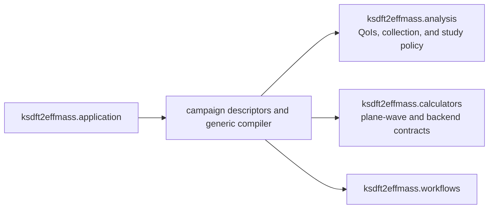

# `ksdft2effmass.campaigns` package

The private and revisable `ksdft2effmass.campaigns` package owns project-specific
composition definitions that bind explicit selected inputs into analysis,
calculator, and Workflow contracts. It does not own generic Workflow or Petri-net
mechanics, calculator behavior, QoI semantics, parameter-study analysis, integration
execution, or scientific acceptance.

Under the selected [plane-wave QoI and parameter-study
architecture](../plane-wave-parameter-studies.md), a campaign may bind an exact
one or more ordered parameter-study revisions, typed role-specific
QoI-to-observation requirements, calculator/backend bindings, ungated run-scoped Task
instances, Workflow and CPN identities, and exact input identities. The generic
`PlaneWaveParameterStudyCompiler` deterministically produces ordered multi-Task
candidate branches, compiled all-of Task gates, a pure CPN, explicit dependencies,
an all-unique-branch collection Task, and a separately gated analysis Task. The
compiled plan retains the complete request.

Reuse is evaluated per Task role. Equal complete execution-defining content requires
the same run-scoped Task instance and produces an explicit candidate/canonical/role
reuse record; distinct content cannot share an instance. A logical candidate remains
in study and observation order even when every Task in its branch reuses a prior
candidate. Nominal identity equality, matching parameter labels, and equal numbers
are insufficient.

`BulkSiliconOptionADescriptor` is the maintained material-specific instantiation. It
contains exact retained compact-input identities, imported-fixture provenance, the
future external workspace root, complete Rydberg-to-electron-volt conversion
ResultObjects, six cutoff candidates, four mesh candidates, and C48/K8 reuse. It is
compiled by the generic compiler; there is no second bulk-specific compiler. Its
nine unique SCF-to-diagnostic-NSCF branches feed an analysis-owned typed observation
collection request and then separate analysis. The descriptor and compiler perform
no file access or scientific execution.

Campaign definitions and compilation do not activate protected execution, grant
authority, run adaptive algorithms, interpret scientific results, or establish
scientific acceptance. An adaptive refinement proposal must first become a validated
immutable successor study revision; any resulting Workflow is compiled separately.
Exact internal submodules and public wire exports remain deferred.
