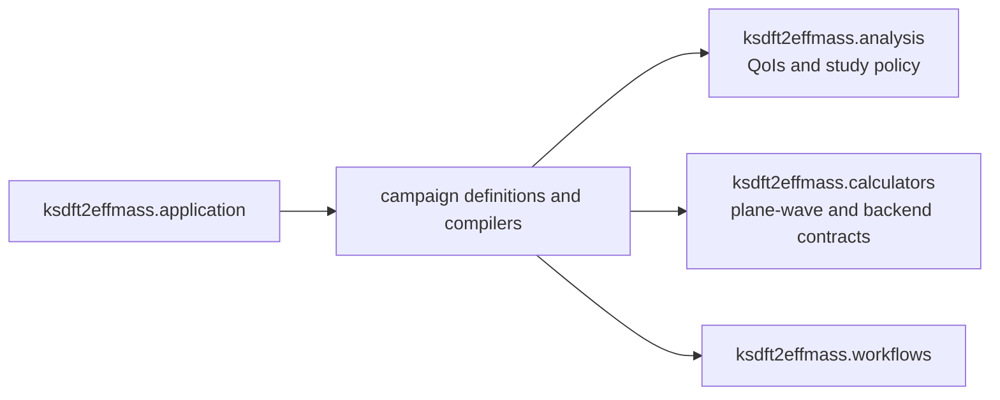

# `ksdft2effmass.campaigns` package

The `ksdft2effmass.campaigns` package owns project-specific composition definitions
that bind explicit selected inputs into analysis,
calculator, and Workflow contracts. It does not own generic Workflow or Petri-net
mechanics, calculator behavior, QoI semantics, parameter-study analysis, integration
execution, or scientific acceptance.

Under the selected [plane-wave QoI and parameter-study
architecture](../plane-wave-parameter-studies.md), a campaign may bind an exact
parameter-study revision, typed QoI-to-observation requirements, calculator/backend
bindings, run-scoped Task instances, Workflow identity, dependencies, and input
artifacts, then deterministically compile them into a complete immutable Workflow
composition and explicit Task dependencies. The compiled plan retains the complete
request. Reuse is permitted only for equal complete candidate specifications and
backend bindings, requires the same run-scoped Task instance, and is recorded
explicitly; nominal identity equality alone is insufficient.

Campaign definitions and compilation do not activate protected execution, grant
authority, run adaptive algorithms, interpret scientific results, or establish
scientific acceptance. An adaptive refinement proposal must first become a validated
immutable successor study revision; any resulting Workflow is compiled separately.
The public `ksdft2effmass.campaigns.research_monograph` subpackage owns the first
supported campaign surfaces: exact harmonic-oscillator study composition and the
one-dimensional particle-in-a-box residual, convergence, higher-eigenpair, norm, and
identifiability studies with version-one retained-format adapters. Reusable observed-
order analysis, spectral-subspace selection, operator compression, and represented-
matrix norms remain below the campaign layer. Later campaign domains require their own
explicit public contracts rather than private or dynamically registered modules.
