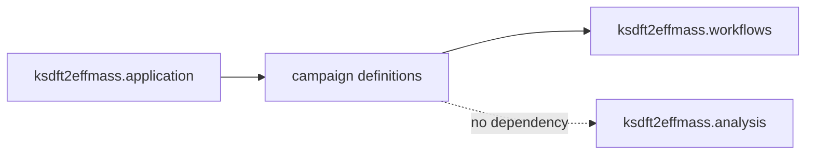

# `ksdft2effmass.campaigns` package

The prospective `ksdft2effmass.campaigns` package owns project-specific
composition definitions that bind accepted scientific work into workflow
contracts. It does not own generic Workflow, Petri-net, calculator, integration,
or analysis semantics.

Campaign definitions do not activate protected execution, grant authority, or
establish scientific acceptance. Exact internal submodules and wire exports
remain deferred.
