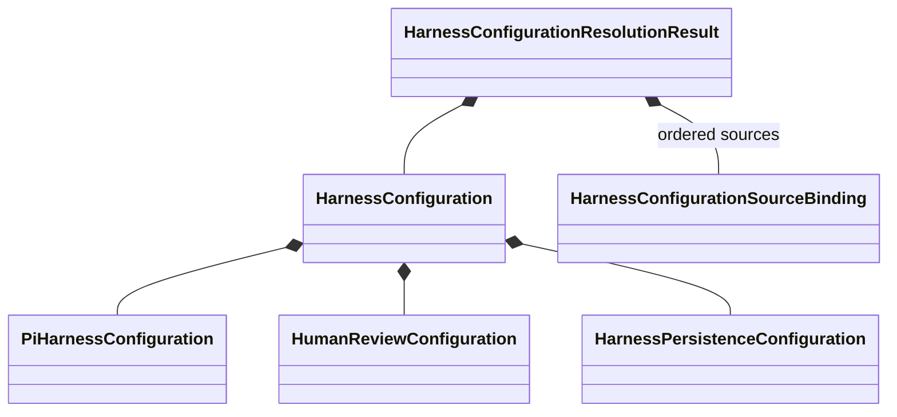

# Development harness configuration

## Purpose and status

This page defines the implemented Architecture-v2 configuration boundary for the
development harness. The canonical harness-owned source is
`harness/configuration.json`; it references the independently Pi-owned
`.pi/settings.json`. Both maintained projection commands resolve those exact sources.
A valid configuration does not authorize any operation.

`HarnessConfiguration` is the immutable resolved configuration used by application
composition. It centralizes the effective value while preserving subsystem ownership.
The separate `HarnessConfigurationResolutionResult` preserves the exact identities of
the inputs from which that value was resolved. The configuration is a DataObject, not
a service locator, authority grant, repository, registry, or source-discovery
mechanism.

## Configuration aggregate

The implemented aggregate and resolution result have these owned components:

| Object | Responsibility |
|---|---|
| `HarnessConfiguration` | Versioned resolved aggregate supplied to application composition |
| `PiHarnessConfiguration` | Normalized Pi-owned settings subset consumed by harness operations |
| `HumanReviewConfiguration` | Review-packet and optional non-authoritative decision-projection destinations |
| `HarnessPersistenceConfiguration` | Root-confined database, SQL-export, and projection-manifest paths |
| `HarnessConfigurationResolutionResult` | Closed resolution status, resolved configuration or findings, ordered source bindings, and snapshot identity |
| `HarnessConfigurationSourceBinding` | Exact path, content identity, and represented role of one source payload |

The public API defines configuration source/resolved schema 2 only. The canonical
repository source uses schema 2 with categorized Task roots. Source and resolved
schema 1 are retired; consumers preserve observed paths across all three catalogs.
Nested configuration objects live with their subsystem and own their intrinsic
invariants. `HarnessConfiguration` owns aggregate field presence and version
invariants. Cross-component agreement belongs to explicit ActionObjects.

## Source and resolved configuration

Configuration authority and runtime composition are distinct:

1. Pi continues to own its complete project-settings format and runtime semantics.
2. The harness owns its harness-native configuration source.
3. `HarnessConfigurationResolver` receives explicit harness-native bytes, explicit Pi
   settings bytes, and their exact source paths.
4. The resolver delegates Pi normalization to `PiHarnessConfigurationDeserializer`,
   resolves harness-native sections, checks cross-source compatibility, and returns one
   immutable `HarnessConfiguration` result.
5. Application composition injects that exact resolved value into the operations that
   require it.

No configuration operation searches the current directory, selects an ambient file,
reads environment variables implicitly, or chooses a fallback source. Paths and bytes
are supplied explicitly by the application boundary. A missing, mismatched,
unsupported, or indeterminate required source produces no resolved configuration.

Encapsulating `PiHarnessConfiguration` does not transfer ownership of `.pi/settings.json`
to the harness and does not create a second editable copy of Pi settings. The nested
value is the normalized consumed subset. Its Pi source binding remains on the
resolution result and is not part of configuration equality or resolved JSON.

## Human-review configuration

`HumanReviewConfiguration` configures review infrastructure, not humans or human
authority. Version 1 configures the root for transient review-packet artifacts and an
optional destination for human-readable decision projections. It does not yet select
additional formats or retention policy.

It does not configure:

- whether verbatim human responses are retained;
- human identity, authority, or authentication policy;
- natural-language interpretation;
- acceptance semantics;
- checkpoint resolution;
- automatic successor activation; or
- scientific or protected-execution authority.

Authoritative `DevelopmentDecision` values remain inside the complete
`HarnessState` aggregate and follow `HarnessPersistenceConfiguration`. A
human-readable decision file is a projection and cannot become a second decision
store. Selecting a separate authoritative human-decision repository would require a
new architecture decision that revises the accepted `HarnessState` boundary.

## Persistence configuration

`HarnessPersistenceConfiguration` supplies immutable values needed by application
composition to construct `HarnessStateAtomicRepository` with the selected shared
`AtomicRevisionStore`. Configuration contains data needed for construction; it does
not contain a live connection, repository, serializer, validator, lock, callback, or
credential.

The initial Architecture-v2 realization remains the standard-library SQLite shared
store selected by the shared persistence contract. Configuration may select its
explicit root-confined database location and supported operational parameters once
those fields are specified. It does not select a different backend through an
unbounded plugin name or silently fall back when construction fails.

Development `HarnessState` and scientific `WorkflowRun` storage remain separate by
default. Configuration cannot merge their aggregates, authority, or transaction
boundaries.

## Serialization contract

The initial public wire format is canonical versioned JSON. The implemented public
ActionObjects are:

- `HarnessConfigurationJsonSerializer`; and
- `HarnessConfigurationJsonDeserializer`.

The serializer receives one exact `HarnessConfiguration` and emits canonical UTF-8
JSON bytes. The deserializer receives explicit bytes and returns the represented
immutable aggregate or rejects invalid input. Neither ActionObject reads files,
resolves sources, opens repositories, validates authority, or constructs runtime
services.

JSON round trips preserve every nested normalized configuration value and ordering
rule. Source bindings and snapshot identity remain only on
`HarnessConfigurationResolutionResult`; they are deliberately absent from resolved
JSON and configuration equality. Wire validity establishes only represented
configuration agreement. It does not establish that source files are current, paths
exist, a repository can be opened, an authority grant is valid, or an operation is
permitted.

YAML is deferred. Adding YAML requires a separately accepted wire contract, explicit
format-specific ActionObjects, deterministic mapping to the same normalized aggregate,
and an authorized parser dependency or an accepted dependency-free implementation.
Format is never inferred from payload content or filename extension. YAML must not
silently alter scalar types, key uniqueness, ordering, null semantics, or version
behavior relative to the normalized configuration contract.

## Action and protocol boundaries

The configuration boundary uses concrete immutable DataObjects. It does not introduce
a generic `ConfigurationProtocol` merely to coordinate values with a closed versioned
wire contract.

Protocols remain appropriate for runtime capabilities with demonstrated multiple
implementations, such as `AtomicRevisionStore` or a review-artifact publisher.
`HarnessConfiguration` may select or parameterize application composition, but it does
not contain protocol implementations. The composition root constructs implementations
and injects them separately.

The implemented actions have distinct responsibilities:

| ActionObject | Responsibility |
|---|---|
| `HarnessConfigurationResolver` | Resolve explicit identified sources into one effective aggregate |
| `HarnessConfigurationValidator` | Check cross-component configuration compatibility without opening runtime services |
| `HarnessConfigurationJsonSerializer` | Encode the resolved aggregate as canonical JSON |
| `HarnessConfigurationJsonDeserializer` | Decode explicit canonical-contract JSON bytes |

Subsystem deserializers and validators remain with their domain owners. The aggregate
resolver composes them rather than reimplementing their rules.

## Failure and authority boundaries

Configuration resolution and decoding fail closed within each owner's contract.
Unknown format versions, duplicate keys, unsupported members, and invalid nested
values in the harness-native or canonical aggregate wire do not produce a usable
aggregate. Complete Pi project settings retain Pi's open external format: the
Pi-owned deserializer may ignore fields outside its explicitly consumed subset while
strictly validating fields that determine that subset. Source-path mismatches and
cross-component incompatibilities likewise produce no usable aggregate. The resolver
returns the closed `HarnessConfigurationResolutionResult` with ordered sanitized
findings on failure.

A valid `HarnessConfiguration` grants no Task activation, repository mutation,
human acceptance, scientific execution, protected operation, publication, or release
authority. It cannot authorize itself or select an authority ledger. Credentials,
private keys, unrestricted environment content, and external scientific payloads are
excluded.

## Implemented initial slice

The initial slice implements the immutable DataObjects, exact source bindings on the
resolution result, deterministic resolution, canonical JSON actions, and focused
software verification.
The maintained v1 projection synchronization and checking paths consume the same
freshly resolved aggregate. The CLI accepts only the action and explicit repository
root; configuration-owned path flags and hard-coded canonical consumer constants were
removed. Low-level explicit request fields remain only for isolated injected tests.

The slice adds no YAML, dependency, plugin registry, live repository construction,
automatic fallback, credentials, authority interpretation, scientific behavior, or
protected execution.

## Task catalog configuration — clean categorized cutover

The selected next extension is Task organization only, not project-wide research
or simulation configuration. The direction and bounded recording authority are
retained in `harness/intake/task-catalog-configuration.md`; implementation is tracked
by `harness.task-catalog-configuration`. That Task is not activated by this page.
The live configuration uses `catalogs.task_catalog` and the three locations below.
The shared reader supplies immutable actual-path/Task observations to validation
and ingestion. Projection reconstruction preserves these paths. All 217 Tasks
were relocated byte-for-byte after identity, destination and graph preflight; the
old flat directory is retired. Migration changes no Task lifecycle or authority.

The Task is selected for implementation under the continuation instruction
recorded in that intake. Its bounded plan and direct adversarial self-assessment
are in `harness/reports/task-catalog-configuration-plan.md`; the complete proposed
classification is `harness/reports/task-catalog-classification.json`, accompanied
by `harness/reports/task-catalog-path-references.json`. The subsequent clean-cutover
instruction supersedes the earlier schema-1 compatibility choice; the five confirmed
mixed-purpose destinations remain unchanged. Schema-1 configuration is rejected,
not silently upgraded. Earlier decisions and checks remain historical in the intake
and `harness/reports/task-catalog-configuration-implementation.md`; current results
are recorded in `harness/reports/task-catalog-clean-cutover.md`.

### Configuration ownership

The immutable `TaskCatalogConfiguration` represents three explicit root-relative
catalog locations in `research_root`, `simulation_root` and `software_root`. It
composes through `HarnessCatalogConfiguration.task_catalog` into
`HarnessConfiguration`, rather than introducing another top-level aggregate. It owns intrinsic path invariants,
not discovery, file I/O, classification of existing Tasks, migration or execution.
The existing serializer/resolver and catalog consumer ActionObjects retain those
respective responsibilities. `HarnessCatalogConfiguration` requires `task_catalog`
as its first argument, followed by `agent_roots`, `checkpoint_roots` and `skill_roots`.
There is no flat field or optional-layout branch. Source/resolved configuration is
schema 2 only. Wrong semantic types raise TypeError; invalid roots, unsupported
versions and noncanonical bytes raise ValueError. Canonical JSON retains its ordered
members, indentation, literal Unicode and final LF. Historical schema-1 fixtures
are rejection oracles. Resolution-result, Pi and snapshot framing remain separately
versioned at 1; they are not flat-configuration compatibility layers.

| Catalog | Primary deliverable | Current project location |
|---|---|---|
| Research | Questions, literature assessment, hypotheses, protocols and interpretation | `tasks/research` |
| Simulation | Calculation preparation, execution, convergence and extraction work | `tasks/simulation` |
| Software | Implementation, verification, tooling and infrastructure | `tasks/software` |

Locations are configuration values, not hard-coded category directory names.
Catalog roots must be explicit, normalized, root-relative and non-overlapping;
filesystem consumers must retain root-confinement checks. Task IDs remain globally
unique across all three catalogs. Dependencies may cross catalog boundaries.
Placement conveys neither authority nor completion, and scientific `WorkflowRun`
state remains distinct from these work-management records.

### Consumer integration and migration

Discovery, source validation, control ingestion, reconstruction and projection
verification must consume the same resolved catalog configuration. In particular,
projection reconstruction must preserve each Task's configured source location,
not flatten paths by reconstructing a filename beneath one assumed root.
Duplicate IDs, conflicting source files or invalid locations must fail closed,
not be resolved by filesystem iteration order.

Before relocation, inventory current records and live path consumers, explicitly
map each Task to its primary-deliverable category, and report genuinely ambiguous
classifications rather than infer scientific intent from filenames alone. Preserve
Task IDs, relationships, status, authority references and historical evidence.
Update live references and generated projections together; do not maintain two
authoritative catalog copies or relabel retained historical evidence as having
originated at a new path. The configuration Task itself will move to the configured
software root without changing its ID.

The guarded cutover verified exact source identities and absent destinations,
retained every Task's bytes during relocation, validated the combined graph, switched
the configuration once, and retired the empty source directory. This is not a claim
of global filesystem transactionality or race-free access.

Control database schema 4 stores only current schema-3 Tasks, including optional
`documentation_path`, and removes the obsolete `task_alias` table. Ordinary ingestion
never rewrites `H5` or fabricates an alias. Current ownership validation accepts only
schema 2 and explicit JSON Task paths; it no longer substitutes missing Markdown
bindings. Six orphan declarations were initially retained unchanged, then removed
at the human's explicit request. Their migration/removal audit remains; no absent
Task was recreated.

### Verification and exclusions

Required software evidence includes immutable typed configuration, invalid and
overlapping path rejection, alternate configured locations, duplicate Task IDs
across catalogs, cross-catalog relationships, and source/projection round trips
that preserve exact Task identities and locations. The migration must account for
every original record without loss or duplicate authority, and pass the maintained
Harness validation and projection checks.

This extension configures no physical model, convergence threshold, calculation
parameter, execution backend, credential, scientific acceptance criterion or
protected-operation authority. It adds no plugin registry, workflow engine,
automatic Task activation or competing research manual.

## Deferred details

- Root-confinement rules for intentionally external storage locations.
- SQLite connection, locking, timeout, recovery, and retention parameters beyond the
  configured root-relative persistence paths.
- Whether a separate machine-readable JSON Schema is justified by an external consumer; none is required for the first v1 cutover slice.
- Whether non-authoritative review packets and projections share one artifact root.
- YAML support and parser dependency selection.
