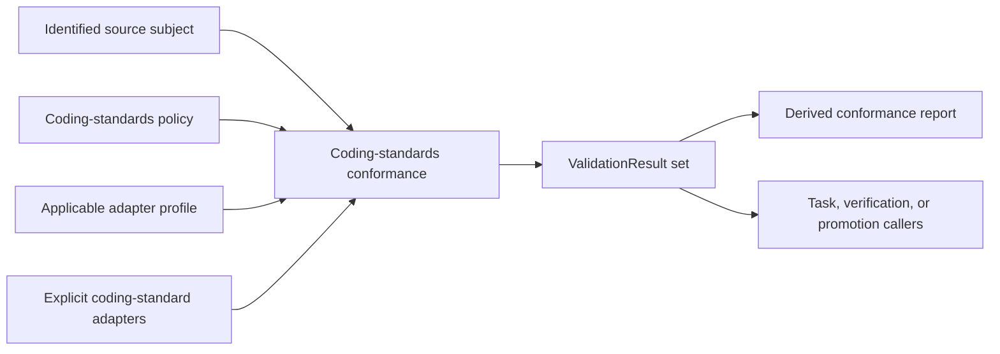

# Coding-standards conformance

## Purpose

Coding-standards conformance evaluates an explicitly identified source subject
against an identified coding-standards policy using explicitly selected
adapters. It normalizes demonstrated structural checks into the shared
[development `ValidationResult`](validation.md) contract.

It does not own Task authorization, development lifecycle, behavioral or
numerical verification, promotion eligibility, human review, repository
mutation, scientific meaning, or scientific execution. Those callers may consume
its identified results without transferring their policy or authority into this
component.

## Boundary

The policy owns requirements. The profile maps an identified subject family and
policy requirements to compatible adapters, versions, and explicit
configuration. It cannot create, omit, weaken, or reclassify requirements.
Callers decide whether a result is required for their own gate; the conformance
component does not make that decision.

## Inputs

One conformance invocation receives:

- exact source paths and content or tree identities;
- coding-standards policy identity and version;
- subject-family identity;
- explicit adapter identities and versions;
- explicit adapter configuration; and
- an applicable profile binding policy requirements to those adapters.

There is no current-directory discovery, ambient latest-policy selection,
mutable adapter registry, or fallback implementation. Missing, incompatible, or
identity-mismatched policy, profile, adapter, configuration, or source input
fails closed.

## Requirement scope

The target preserves demonstrated structural source and maintained-evidence
checks, including applicable:

- module, test, and evidence documentation structure;
- evidence-identifier syntax and uniqueness;
- declared class-owned or artifact-owned evidence ownership;
- filename, test-name, helper, marker, and parameterization conventions;
- static source inventory and maintained-inventory agreement; and
- other explicitly identified coding rules already owned by the selected policy.

The profile selects only requirements applicable to the identified subject
family. A policy-permitted `not_applicable` result is explicit; an adapter cannot
select non-applicability for itself.

Behavioral test execution, numerical acceptance, scientific validation,
uncertainty quantification, dependency selection, Task-graph validity, resource
closure, checkpoint state, control-state projection, and promotion policy are
outside this coding-standards boundary.

## Adapter ownership

An adapter is a target-first ActionObject or thin command boundary over one
demonstrated check family. It receives exact source and policy inputs and returns
identified observations that are mapped without loss into `ValidationResult`.
It does not repair source, edit inventories, reinterpret policy, add a gate, or
perform promotion.

Cross-version source mappings and cutover conditions are owned by the [v1-to-v2 coding-standards migration](../../../migration/v1-to-v2/coding-standards-conformance.md), not by this target contract.

## Results and reporting

[Development validation](validation.md) owns the closed result statuses, field
invariants, finding structure, precedence, and claim boundary. Coding-standards
conformance preserves each adapter, policy, subject, configuration, and source
identity in the applicable result or evidence reference.

A required rule with no compatible adapter produces the applicable represented
`error` or `not_run` outcome and cannot disappear from the result set. Raw command
output is bounded supporting evidence, not the architectural interface.

A conformance report is a derived view over identified results. It does not
replace those results, become source authority, authorize an operation, or enter
human-authored `docs/` as a generated projection.

## Compatibility requirement

Migration must preserve, for controlled valid and invalid source fixtures:

- accepted and rejected cases;
- stable finding meaning and subject attribution;
- deterministic ordering;
- exit-status/result-status agreement;
- nonmutation; and
- structural-only claim boundaries.

A normalization change may improve representation without silently changing a
coding rule. A rule change belongs to coding-standards policy and requires its
own authority rather than being hidden in an adapter or profile.

## Non-goals

Coding-standards conformance does not establish runtime correctness, test
success, numerical verification, scientific validity, complete semantic
ownership, general program purity, Task completion, promotion eligibility,
human acceptance, or execution authority.

## Deferred implementation details

- Exact public request, profile, adapter, aggregate-result, and report names and
  wire fields.
- Exact policy resource and subject-family representation.
- Exact adapter packaging and command/API boundaries.
