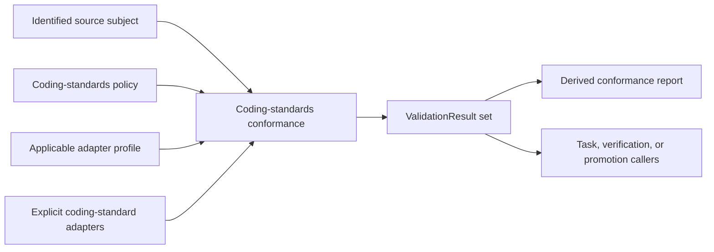

# Coding-standards conformance

## Purpose

Coding-standards conformance evaluates an explicitly identified source subject
against an identified coding-standards policy using explicitly selected
adapters. It normalizes demonstrated structural checks into the shared
[development `ValidationResult`](validation.md) contract.

It does not own Task authorization, development lifecycle, behavioral or
numerical verification, promotion eligibility, human review, repository
mutation, scientific meaning, or scientific execution. Those callers may consume
its identified results without transferring their policy or authority into this
component.

## Boundary

The policy owns requirements. The profile maps an identified subject family and
policy requirements to compatible adapters, versions, and explicit
configuration. It cannot create, omit, weaken, or reclassify requirements.
Callers decide whether a result is required for their own gate; the conformance
component does not make that decision.

## Inputs

One conformance invocation receives:

- exact source paths and content or tree identities;
- coding-standards policy identity and version;
- subject-family identity;
- explicit adapter identities and versions;
- explicit adapter configuration; and
- an applicable profile binding policy requirements to those adapters.

There is no current-directory discovery, ambient latest-policy selection,
mutable adapter registry, or fallback implementation. Missing, incompatible, or
identity-mismatched policy, profile, adapter, configuration, or source input
fails closed.

## Requirement scope

The target preserves demonstrated structural source and maintained-evidence
checks, including applicable:

- module, test, and evidence documentation structure;
- evidence-identifier syntax and uniqueness;
- declared class-owned or artifact-owned evidence ownership;
- filename, test-name, helper, marker, and parameterization conventions;
- static source inventory and maintained-inventory agreement; and
- other explicitly identified coding rules already owned by the selected policy.

The profile selects only requirements applicable to the identified subject
family. A policy-permitted `not_applicable` result is explicit; an adapter cannot
select non-applicability for itself.

Behavioral test execution, numerical acceptance, scientific validation,
uncertainty quantification, dependency selection, Task-graph validity, resource
closure, checkpoint state, control-state projection, and promotion policy are
outside this coding-standards boundary.

## Adapter ownership

An adapter is a target-first ActionObject or thin command boundary over one
demonstrated check family. It receives exact source and policy inputs and returns
identified observations that are mapped without loss into `ValidationResult`.
It does not repair source, edit inventories, reinterpret policy, add a gate, or
perform promotion.

Cross-version source mappings and cutover conditions are owned by the [v1-to-v2 coding-standards migration](../../../migration/v1-to-v2/coding-standards-conformance.md), not by this target contract.

## Results and reporting

[Development validation](validation.md) owns the closed result statuses, field
invariants, finding structure, precedence, and claim boundary. Coding-standards
conformance preserves each adapter, policy, subject, configuration, and source
identity in the applicable result or evidence reference.

A required rule with no compatible adapter produces the applicable represented
`error` or `not_run` outcome and cannot disappear from the result set. Raw command
output is bounded supporting evidence, not the architectural interface.

A conformance report is a derived view over identified results. It does not
replace those results, become source authority, authorize an operation, or enter
human-authored `docs/` as a generated projection.

## Explicit-input production-source facts

The unsupported implementation sibling uses subject family
`python.production-source` and profile `ksdft2effmass.python.production-facts:1`.
It does not alter the accepted version-one `python.test-evidence` subject, profile,
adapter, behavior, or supported package exports. Callers supply an immutable nonempty
tuple of source entries. Each entry contains a caller identity, an exact normalized
repository-relative diagnostic path, and exactly one byte payload or deterministic
read failure. The inspector performs no filesystem or current-directory discovery.

Every supplied entry produces one immutable module outcome. Byte inputs retain their
SHA-256 and byte count and produce either neutral facts or one UTF-8 decode or syntax
failure; read failures retain the exact diagnostic path and caller-supplied failure.
Duplicate paths and identities are retained as repeated outcomes rather than merged.
Outcomes are canonically ordered by path, input identity, byte identity/count, and
complete represented failure kind, diagnostic message, and source position. Distinct
read failures therefore do not inherit caller order when path and identity coincide.
Syntax facts preserve source order through exact source spans.

A successful module represents classes; named, asynchronous, nested, method, and
lambda callables; import and from-import edges; call sites; and raw/effective
``__all__`` syntax. Class and function type-parameter bounds/defaults are visited in
their outer lexical owner and neutral execution context. Each import edge retains the
exact span of its imported name and optional alias rather than the enclosing statement
span. Imports and calls retain enclosing lexical owners and neutral conditional,
guarded, local, and comprehension contexts. Calls retain the syntactic callee plus
direct-name or attribute-receiver information without resolving dispatch.

Every ``__all__`` augmented assignment retains its exact closed operator kind.
Effective literal resolution is limited to direct unconditional list/tuple string
literal assignment followed only by proven additive partitions: list ``+=`` exact list
or tuple literals, and tuple ``+=`` exact tuple literals. Tuple ``+=`` list, every
non-add operator, conditional operation, nonliteral expression, mutation, and deletion
is explicitly dynamic rather than guessed. A later direct unconditional literal
assignment may establish a new exact state. No retained result contains a mutable AST.

These are syntax observations, not support classifications, conformance findings,
dependency-graph defects, ownership judgments, runtime guarantees, or proof of
semantic resolution. The descriptive implementation names remain deliberately absent
from package and subpackage exports and are not supported import routes.

## Callable and private-owner rules

The unsupported callable/private-rule sibling consumes only immutable accepted
``python.production-source`` results and explicit immutable hook exceptions. Each rule
has one stable identity and exactly one classification independent of finding outcome
and severity:

- **deterministic enforcement** covers exact hook-exception integrity, non-entry-point
  module callables, non-underscore top-level implementation-class names, and
  cross-owner private calls only when accepted facts establish both owners;
- **deterministic structural observation** retains private-looking calls whose caller
  or receiver owner is unresolved; and
- **review-only signal** records that ownership of public, scientific, numerical,
  comparison, compatibility, or validation policy cannot be classified without
  separately supplied explicit semantic metadata.

A hook exception is not a name-based waiver. It binds the exact diagnostic path,
source SHA-256 identity, callable qualified name/kind/span, external hook owner and
framework/language/packaging kind, and applicable synchronous or asynchronous named
function shape. Duplicate, stale, source- or shape-mismatched, and owned-but-unused
exceptions produce deterministic violations and do not exempt a callable.

Private-call resolution is deliberately conservative. Accepted facts establish the
lexical caller owner and retain only receiver expression text; they do not retain
sufficient Python binding facts to establish a non-self receiver owner. Exact
owner-local ``self`` private mechanics remain allowed. Class-name, zero-argument
constructor-name, alias, computed, parameter-shadowable, local-shadowable, ``cls``,
and all other non-self receiver candidates remain structural observations, never
guessed violations. Consequently the current fact shape emits no cross-owner
violation; a later violation requires separately authorized richer supplied binding
facts that establish both owners without name inference. The accepted fact profile
records calls rather than general non-call attribute access, so this slice claims no
broader private-access coverage.

The canonical semantic-policy rule remains classified as review-only, but underscore
spelling is not semantic metadata. No semantic-policy finding is emitted without
separately supplied explicit metadata, which this slice does not invent.

Hook findings retain a verified location only after source path, source identity, and
the callable fact have matched. Source-path, source-identity, stale-callable, and
unverified duplicate failures retain their exact exception attribution but have no
verified source location. Shape-mismatch and owned-but-unused findings retain the
matched callable location.

Results retain exact path, source identity, verified span when available, lexical
owner, resolved receiver owner when available, call expression, canonical rule,
compatible outcome/severity, and applicable hook input. Evaluation
is read-only and makes no source move, rename, repair, export/support decision,
dependency-graph decision, runtime-dispatch claim, or semantic-policy inference. The
implementation names are intentionally not re-exported or documented as supported
imports.

## Dependency graph views

The unsupported dependency-graph sibling consumes only immutable accepted
``python.production-source`` results, an exact caller-supplied module identity for
every successful source outcome, explicit caller-supplied package-facade identities,
and optional exact direction checks. Module bindings include the production input
identity, diagnostic path, and SHA-256. They must uniquely and completely cover the
successful supplied facts; failed inputs contribute no graph node, and ambiguous
duplicate successful identities fail closed. A result containing only represented
failures requires no bindings and returns all three empty views. Mixed results bind
only their successful outcomes while retaining failures in the supplied production
result. The analyzer performs no filesystem or current-directory discovery.

One invocation always returns three separately identified views rather than selecting
a universal graph meaning:

- **lexical** retains every represented internal import edge, including conditional,
  guarded, class-body, callable-local, and comprehension imports;
- **runtime-unconditional** retains represented imports with no execution context and
  no callable lexical owner; an unconditional class-body import remains included,
  while this structural view makes no guarantee about successful runtime import; and
- **package-facade-excluded** applies the lexical edge rule after omitting nodes that
  the caller explicitly identified as package facades and every incident edge. It does
  not infer facade status from a path or module spelling.

Plain imports resolve only to exact supplied module identities. From-imports retain the
accepted dual-edge rule: the exact maintained base facade is one target when present,
and each imported name that is itself an exact maintained submodule is another target.
Relative imports resolve against the explicit module and facade identity. External,
unresolved, above-root, and self edges do not become internal graph edges.

Every node, edge, and strongly connected component names its graph view. An edge
aggregates canonically ordered provenance for every contributing import: the exact
source module binding with input identity, path, SHA-256 and explicit facade status;
the complete immutable import fact with lexical owners, execution contexts and span;
and whether resolution was a direct import, from-facade edge, or imported-submodule
edge. Each contribution must resolve to its represented endpoints. Nodes and endpoint
pairs are unique and canonically ordered. A deterministic Kosaraju two-pass traversal
returns the exact canonical partition containing singleton as well as multi-module
components; directly constructed contradictory partitions are rejected. A component
is a structural result for only its named view; a lexical component is not evidence
of a runtime import failure.

Dependency-direction enforcement is opt-in per exact requested view and edge. A check
passes only when that edge is present and its explicitly supplied accepted contract
matches the same view, source module, and target module with an ``allow`` disposition.
Missing contracts, mismatched contracts, prohibited edges, and contracted edges absent
from the selected view are distinct fail-closed results. Every result for an observed
edge, including missing-contract and mismatched-contract results, retains that exact
edge and its complete provenance and requires it to belong to the represented view.
An edge-absent result retains no edge and requires it to be absent; direct aggregate
construction cannot erase an observed edge. Within one request and directly
constructed aggregate result, one accepted-contract identity must map to one exact
view, edge, and disposition payload. Distinct contract identities that allow and
prohibit the same exact view, source, and target are contradictory and fail closed;
contract ordering supplies no precedence. Observed edges for which no check was
requested receive no disposition; an unlisted Architecture v2 edge is never converted
into a universal prohibition.

Requests, module bindings, contracts, checks, provenance, nodes, edges, components,
view results, and direction results are frozen, closed typed values. Analysis is
read-only and performs no import execution, runtime dispatch inference, source repair,
package export or support decision, dependency change, or graph-driven source change.
The implementation names remain intentionally absent from package and subpackage
exports and are not supported import routes.

## Compatibility requirement

Migration must preserve, for controlled valid and invalid source fixtures:

- accepted and rejected cases;
- stable finding meaning and subject attribution;
- deterministic ordering;
- exit-status/result-status agreement;
- nonmutation; and
- structural-only claim boundaries.

A normalization change may improve representation without silently changing a
coding rule. A rule change belongs to coding-standards policy and requires its
own authority rather than being hidden in an adapter or profile.

## Non-goals

Coding-standards conformance does not establish runtime correctness, test
success, numerical verification, scientific validity, complete semantic
ownership, general program purity, Task completion, promotion eligibility,
human acceptance, or execution authority.

## Implemented version-one contract

The public package-level records are `ConformanceInput`, `ConformanceSubject`,
`CodingStandardRequirement`, `CodingStandardsPolicy`,
`ConformanceAdapterConfiguration`, `ConformanceProfileBinding`,
`ConformanceProfile`, and `ConformanceRequest`. The structural adapter protocol is
`CodingStandardsAdapter`; `CodingStandardsConformanceValidator` owns deterministic
composition into `ValidationResult`.

`PythonCodingStandardsContract` supplies the explicit version-one Python policy,
profile, and immutable configuration, while `PythonCodingStandardsAdapter` maps the
implemented Python evidence diagnostics and strict project syntax facts. A sorted
unique `path:line` configuration entry is required when an `object` annotation
intentionally declares the domain of every Python object; the adapter does not infer
that semantic exception from syntax. The class-owned parser retains callable
assignments, enclosing class, decorator, method-documentation, resolved typing, type
comment, and erased-container facts from one AST parse without retaining the AST.

`ConformanceReportProjector` derives `ConformanceReport` from one exact normalized
result. No wire format, repository loader, ambient adapter registry, automatic repair,
or promotion gate is introduced by version one.
