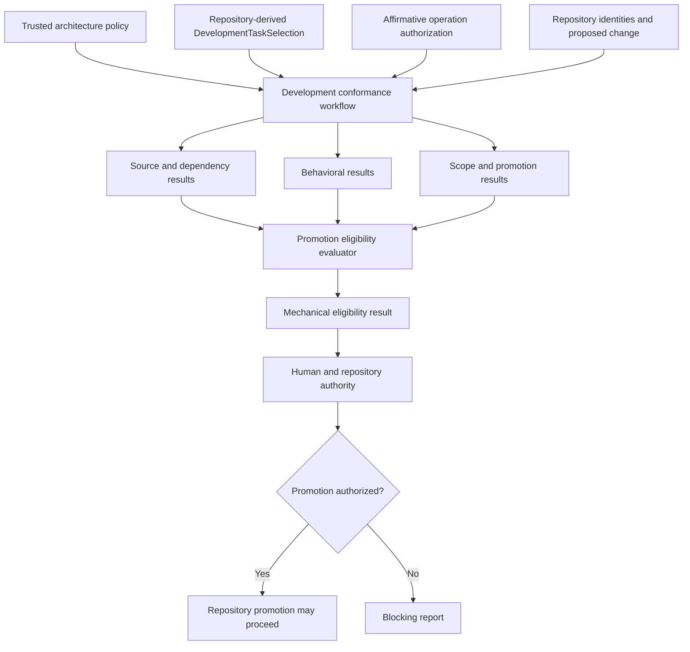

# Development conformance

## Purpose

Development conformance evaluates whether a proposed repository change satisfies
identified architecture policy, a candidate-independent matching Task authorization, software-contract checks,
and promotion requirements. Its subject is the whole repository, including the
development harness, workflow packages, calculator integrations, scientific
semantics, tests, fixtures, and documentation.

The development harness owns conformance execution. It does not thereby own the
meaning of every contract it evaluates. Package contracts, scientific
specifications, test-evidence requirements, and documentation requirements
remain with their authoritative domains.

Development conformance does not execute a scientific `Workflow`, advance a
`WorkflowRun`, or establish numerical verification, scientific validation,
scientific acceptance or human acceptance merely because software checks
pass.

## Authority and ownership

The local Architecture v2 ownership is:

| Concern | Owner |
|---|---|
| Generic conformance records, composition, aggregation, and reporting | `ksdft2effmass.harness` |
| Concrete repository architecture policy | `ksdft2effmass.harness` composition using authoritative project contracts |
| Scientific workflow contracts | `ksdft2effmass.workflows` |
| Project-specific campaign definitions | `ksdft2effmass.campaigns` |
| Calculator, scientific, test, and documentation meaning | The applicable owning package, specification, test contract, or documentation policy |
| Required status checks, protected branches, and merge refusal | Repository platform |
| Architecture, protected actions, review, and acceptance where required | Human authority recorded by the development control plane |

A future `projectkoios.bootstrap` extraction may own demonstrated generic
conformance mechanisms. If the Architecture v2 target is implemented before
that extraction is separately accepted, its implementation remains local.
Project-specific policy does not become generic merely because a generic
evaluator can consume it.

## Architectural flow



`DevelopmentTaskSelection` is repository-derived requested/selected work state, never authority or permission. For the checks required by the independently resolved Task authorization $T$, mechanical eligibility is

$$
E(C,A,T)=\bigwedge_{i\in R(T)}G_i(C,A,T),
$$

where $C$ is the identified proposed change, $A$ is the identified architecture
policy, $R(T)$ is the required-check set, and each required gate $G_i$ must
produce a passing result.

Promotion authorization is separate:

$$
P(C,A,T,H)=E(C,A,T)\land H,
$$

where $H$ represents independently recorded human approvals and repository
rules. The deterministic evaluator calculates $E$; it does not manufacture
$H$.

## Core records

The conformance system uses immutable or operationally immutable records:

| Record | Responsibility |
|---|---|
| `ArchitecturePolicy` | Identified package boundaries, public interfaces, object-role rules, lifecycle rules, and available gate definitions |
| `TaskAuthorization` | Exact selection and Task revisions, starting and candidate revisions, operation, permitted paths, architecture-policy identity, lifecycle stage, exclusions, and required checks |
| `DevelopmentOperationAuthorizationResult` | Exact `authorized`, `denied`, or `error` outcome binding one operation and candidate-independent authority context without performing the operation |
| `RepositorySnapshotIdentity` | Exact repository, revision or tree, and relevant source identity |
| `ChangeSet` | Added, modified, deleted, renamed, mode-changed, symlink, and other represented repository changes |
| `ValidationRequirement` | Stable rule identity, version, applicability, severity, and blocking behavior |
| `ValidationResult` | One validator-invocation outcome, including any explicitly composed subordinate findings and evidence references |
| `ConformanceProfile` | Complete architecture policy, ordered validators, required gates, and tool configuration used by one evaluation |
| `PromotionEligibilityResult` | Mechanical gate outcome and its complete required-result identities |
| `PromotionAuthorization` | Separately recorded review and repository authority for an identified eligibility result |
| `ValidationReport` | Machine-readable evidence and a human-readable projection input |

A `PromotionEligibilityResult` is not named `PromotionDecision` because it does
not record human acceptance or perform a repository mutation.

## Validation outcomes

A `ValidationResult` uses the closed outcome vocabulary:

```text
pass
fail
error
not_run
not_applicable
```

The closed status-dependent invariants are:

| Status | Required invariant |
|---|---|
| `not_applicable` | If and only if applicability is not applicable, the requirement/profile permits it, and a nonempty not-applicable reason is recorded; other statuses require applicable and no not-applicable reason. |
| `pass` | Execution completed; no applicable requirement failed; no error diagnostic or blocking finding exists. |
| `fail` | Execution completed and at least one identified applicable requirement failed. |
| `error` | Validation could not establish pass or fail and carries a nonempty error diagnostic. |
| `not_run` | The invocation did not execute or complete and carries no fabricated success evidence. |

`blocking` is deterministically derived from identified requirement/profile criticality and findings, never selected independently. A required `error`, `not_run`, or `fail` blocks its gate. Every applicable required check must pass; infrastructure errors and omitted checks cannot become successful conformance.

A composite validator such as `HarnessStateValidator` returns the same `ValidationResult`, preserves every child identity and finding, and derives its status over all applicable child invocations with precedence `error`, then `not_run`, then `fail`, then `pass`; child requirement criticality affects `blocking`, not whether the child's outcome contributes to composite status. Composite `not_applicable` is valid only when the composite requirement permits it and no child invocation is applicable. Contradictory field combinations are invalid.

Each result contains exactly the contractually required fields:

```text
result_identity
validator_identity
requirement_identity
rule_identity
rule_version_identity
summary
applicability
applicability_reason  # nonempty only for not_applicable
subject_identity
execution_completed
status  # pass | fail | error | not_run | not_applicable
ordered_findings
error_diagnostic
blocking  # derived
child_result_identities
tool_identity
configuration_identity
environment_identity
evidence_references
affected_paths
claim_boundary
```

Raw tool output is retained evidence when required, not the architectural
interface.

## Retention boundary

`ValidationResult`, `ValidationReport`, and `PromotionEligibilityResult` become maintained development evidence only through the applicable evidence repository. Maintained catalog entries retain their exact identities, claim boundaries, and source references. A report is derived presentation and does not replace its evidence records. An ephemeral local check is identified as such and cannot later satisfy a required evidence gate merely because it once passed. Producing a result does not by itself make it authoritative.

## Action and Workflow ownership

External and reusable operations belong to explicit ActionObjects:

```text
DevelopmentAuthorityContextResolver
DevelopmentOperationAuthorizer
RepositoryChangeInspector
SourceConformanceValidator
DependencyConformanceValidator
BehavioralConformanceValidator
TaskScopeValidator
ArtifactPromotionValidator
PromotionEligibilityEvaluator
ValidationReporter
```

`DevelopmentConformanceWorkflow` is the explicit reusable composition of
inspection, validation, and eligibility evaluation. It receives a complete
`ConformanceProfile` and explicit repository context. It does not discover
ambient policy, mutate the proposed change, repair failures, record human
approval, or merge code.

ActionObjects may retain immutable configuration and explicit tool adapters.
Statelessness means that they own no hidden or evolving domain state; it does not
require empty instances.

## Composition instead of architecture subclassing

A project specializes conformance by supplying an immutable policy and explicit
validator composition. It does not subclass a nominal
`BaseConformanceArchitecture` and override inherited policy.

Conceptually:

```python
profile = ConformanceProfile(
    policy=architecture_policy,
    validators=(
        source_validator,
        dependency_validator,
        behavioral_validator,
        scope_validator,
        promotion_validator,
    ),
    required_gates=task_authorization.required_checks,
)

result = DevelopmentConformanceWorkflow(...).execute(
    context=repository_context,
    profile=profile,
    authority_context=candidate_independent_authority_context,
    authorization=affirmative_operation_authorization_result,
)
```

Validators may satisfy a narrow structural protocol when multiple concrete
implementations are demonstrated:

```python
class ConformanceValidator(Protocol):
    @property
    def requirement_identities(self) -> tuple[ValidationRuleIdentity, ...]: ...

    def execute(
        self,
        context: ConformanceContext,
    ) -> ValidationResult: ...
```

No nominal validator or architecture base class exists solely to label an
implementation. Explicit composition makes the effective policy, validator
ordering, rule versions, and tool configuration inspectable, serializable where
required, and eligible for stable identity.

## Enforcement planes

### Source-conformance plane

This plane evaluates properties represented in the source tree:

- formatting and ordinary lint requirements;
- declared typing requirements;
- DataObject, ResultObject, and ActionObject structural rules;
- package boundaries, public interfaces, and dependency cycles;
- maintained test organization where required; and
- explicitly prohibited imports and constructs.

Ruff, mypy, Tach, and a narrow project AST adapter may provide these checks.
AST rules must be syntactically precise and must not claim to prove general
purity, semantic ownership, scientific correctness, or the absence of all
mutable behavior.

### Behavioral-conformance plane

This plane invokes the applicable software, property, integration,
serialization, state-machine, and numerical-contract checks. The authoritative
meaning and acceptance rule of each check remain with its owning contract.

Passing software tests establishes only the represented software contract. A
numerical-verification, scientific-validation, or uncertainty-quantification
claim requires its separately classified evidence and authority.

### Behavioral process boundary

Candidate behavioral checks run as ordinary explicitly configured subprocesses; Architecture v2 requires no custom sandbox. One immutable invocation identifies the executable and arguments, trusted repository root, confined working directory, explicit sanitized environment, tool/configuration identities, timeout, and output-size limits. Ambient shell command construction, unrestricted environment inheritance, credentials, and an unconfined working directory are prohibited.

The runner captures bounded stdout and stderr plus start, completion, exit, timeout, cancellation, and signal facts. A completed tool-defined success or assertion failure maps to `pass` or `fail` under the owning validator contract. Launch or protocol failure maps to `error`. Timeout, cancellation, or signal termination maps to `not_run`, retains identified partial output as limited evidence, and blocks a required gate. Output truncation that prevents interpretation maps to `error`. None of these outcomes authorizes a retry or implies scientific correctness.

Stronger operating-system, container, or remote isolation is a deployment concern that requires a concrete threat model; it is not part of the current architecture.

### Authorization plane

This plane evaluates whether the change is permitted independently of whether
its implementation is correct. `DevelopmentAuthorityContextResolver` reconstructs and verifies the explicitly selected candidate-independent `DevelopmentAuthorityContext`. `DevelopmentOperationAuthorizer` then returns an affirmative result only when that context contains one unrevoked `TaskAuthorization` matching the repository-derived selection and exact Task revision. Authorization checks at least:

- exact selection and Task revisions;
- starting and candidate revisions;
- requested operation;
- permitted and prohibited paths;
- authorized lifecycle stage;
- architecture-policy identity;
- required-check completeness;
- protected architecture and control records; and
- declared deviations.

Repository operations not representable by a Git tree difference require
explicit event or audit metadata. A `ChangeSet` accounts for additions,
deletions, renames, file-mode changes, symlink changes, and other supported Git
change classes rather than only changed text lines.

### Governance plane

Local hooks provide feedback but are not authoritative. Required CI statuses,
repository rulesets, protected branches, `CODEOWNERS`, and recorded human review
provide governance outside the deterministic evaluator. The aggregate status is
the required mechanical gate; individual adapter statuses remain diagnostic.

## Trusted-input boundary

A `HarnessTask`, `DevelopmentTaskSelection`, candidate decision, and candidate change must not authorize themselves. Selection records requested/selected work only. Before candidate-controlled code
is executed, conformance establishes immutable identities for:

- the trusted starting revision;
- the candidate revision or tree;
- the selected architecture policy and content digest;
- the Task authorization and content digest;
- validator implementations and configuration;
- required checks; and
- the execution environment and toolchain.

Policy and authorization are loaded from a protected base revision, protected
control store, signed record, or another explicitly trusted source. A candidate
may propose changes to those records, but the proposed records do not govern
their own acceptance.

An operation may proceed only when `DevelopmentOperationAuthorizer` returns an exact affirmative result for the context, selection and Task revisions, starting and candidate revisions, operation, and permitted paths. A target operation verifies that result's identity bindings but does not resolve the ledger or reinterpret authorization policy.

The safe execution order is:

```text
repository-derived selection + candidate-independent trusted policy and authorization
→ repository identity and change inspection
→ scope and starting-revision validation
→ static source and dependency validation
→ bounded behavioral validation
→ mechanical eligibility aggregation
→ human and repository authorization
→ report and required status
```

## Domain delegation

Conformance cuts across the stack without reversing runtime dependencies:

| Contract | Meaning owner | Conformance adapter |
|---|---|---|
| Package dependency direction | Architecture policy | Dependency validator |
| DataObject and ActionObject structure | Object-model policy | AST validator |
| Workflow transition behavior | Workflow contracts | Workflow software-verification tests |
| Numerical algorithm behavior | Applicable specification | Numerical-verification tests |
| Public API and serialization behavior | Owning package and schema | Compatibility and integration tests |
| Task scope and starting revision | Task authorization | Scope validator |
| Documentation structure and links | Documentation policy | Documentation checks |

Scientific and workflow packages do not import the development harness merely
because the harness evaluates them. The harness invokes declared adapters or
reads represented evidence through the development composition root.

## Architecture and policy promotion

Draft, spike, implementation, and production status are explicit represented
classifications, not guesses derived only from paths. A promotion request
identifies the artifact, current and requested stage, governing policy,
required evidence, affected public contracts, and required authority.

Changes to the conformance policy or evaluator require a bootstrap-safe route:

1. evaluate the proposal under the currently trusted policy;
2. evaluate the proposed policy in a nonauthoritative diagnostic or dual-run
   mode;
3. report differences explicitly; and
4. require the applicable architecture review before the new policy becomes
   authoritative.

The new evaluator or policy cannot certify itself into authority.

## ProjectKoios extraction boundary

The local implementation should preserve explicit generic seams but does not
create or depend on ProjectKoios repositories merely to anticipate extraction.
A future extraction into `projectkoios.bootstrap` is justified only when local
use demonstrates stable project-independent records, validator protocols,
aggregation, and reporting behavior.

After extraction:

- ProjectKoios may own the generic conformance engine and schemas;
- `ksdft2effmass` retains its concrete architecture policy and domain adapters;
- extraction receives separate dependency, licensing, compatibility, release,
  and migration decisions; and
- existing local behavior remains until equivalence and cutover are accepted.

Architecture specialization continues through policy and composition rather
than subclassing an inherited conformance architecture.

## Explicit non-goals

Development conformance does not:

- decide whether a scientific model is physically appropriate;
- replace human architectural or scientific judgment;
- execute or advance scientific workflows;
- infer authorization from an agent prompt or passing test;
- repair candidate code silently;
- treat a draft ADR or spike as production approval;
- prove general program purity from source structure; or
- make an external calculator deterministic merely by invoking it through a
  validator.

## Principle

> Human authority defines the permitted state space and the requirements for
> promotion. Deterministic validators establish mechanical eligibility against
> identified policy, authorization, repository, and toolchain inputs.
> Repository controls and recorded human decisions determine whether an eligible
> change is authorized for promotion.

## Unresolved issues

- Exact public fields and wire formats of the conformance records.
- Location and representation of concrete Architecture v2 policy resources.
- Exact trust source for policy and Task authorization in local and CI runs.
- Compatibility policy for validator, rule, report, and environment identities.
- Which locally demonstrated components eventually qualify for ProjectKoios
  extraction.

## Development authority context

Conformance receives an immutable, explicit, candidate-independent `DevelopmentAuthorityContext` produced by `DevelopmentAuthorityContextResolver` and an exact `DevelopmentOperationAuthorizationResult` produced by `DevelopmentOperationAuthorizer`. The context identifies a `DevelopmentTrustConfiguration`, a verified `DevelopmentAuthorityLedger` snapshot, its reconstruction receipt, local or CI resolution mode, and every content and authentication verification outcome. The authorization result binds the exact operation inputs and is distinct from `PromotionEligibilityResult`. No candidate-controlled record, ambient checkout state, compiler result, validation result, or target operation selects its own authority. The ledger is protected control-plane state and is not part of repository-derived `HarnessState`.
