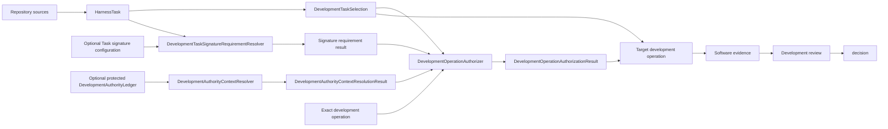

# Development control plane

## Responsibility

The development control plane governs software and documentation work. It owns:

- `HarnessTask` definitions;
- `DevelopmentTaskSelection`;
- development authorization;
- immutable unresolved and resolved/revised `DevelopmentDecision` records;
- software capabilities and resources;
- software-verification and repository-conformance findings;
- mechanical promotion-eligibility results; and
- development review and acceptance state.

It may reference immutable scientific contract or implementation identities. It does not store `WorkflowRun`, `ColoredPetriNetMarking`, calculator execution, scientific analysis or scientific-conclusion state.

## Authority model

Evidence supports a claim but grants no authority. Capability states what an implementation can do. `DevelopmentTaskSelection` states only repository-derived requested/selected work; it is neither authority nor permission. [Coding-standards conformance](conformance.md) returns identified structural validation results only. Task gates, promotion eligibility, human decisions, and repository operations consume those results under their separate owners.

## Explicit context

Repository-sensitive operations receive an explicit repository root, source identities, exact selection and configured-Task revisions, starting and candidate revisions, requested operation, permitted paths, operation requirements, architecture-policy identity, validator-profile identity, and exact signature-requirement result. Task signature configuration defaults to `not_required`; only an explicit configuration for the exact Task revision selects `required`. `DevelopmentOperationAuthorizer` returns one immutable `DevelopmentOperationAuthorizationResult`: `signature_not_required` records only that the optional cryptographic gate was not requested and grants no authority; `authorized` identifies the exact matching unrevoked signed `TaskAuthorization`; `denied` records an established missing, stale, exhausted, revoked, or mismatched required authorization; and `error` records that requirement resolution, authorization, or denial could not be established. Required mode additionally consumes a successful `DevelopmentAuthorityContextResolutionResult` and rechecks that its context records reproduce the independently verified signed-head payload identity. A target operation may consume `signature_not_required` or `authorized` only while independently enforcing every other applicable human-approval and protected-action rule. Ambient discovery is not authority; a `HarnessTask`, selection, candidate decision, validation result, unsigned result, or candidate-controlled policy cannot authorize itself.

## Selection invariants

- At most one development selection is active within one declared control scope.
- Selection references an existing eligible `HarnessTask` revision but grants no authority or permission.
- Automatic successor activation is explicit and disabled by default.
- An unresolved human-owned decision prevents the affected transition.
- Generated projections cannot create or change selection.

## Human decisions and authority

Architecture, scope, dependencies, protected repository actions, review, and development acceptance remain human-owned where policy requires them. The single `DevelopmentDecision` model in `HarnessState` records explicit external input using unresolved and resolved variants/revisions. It preserves the exact request, question, options, scope, verbatim response, an unambiguous normalized declared outcome, source/authority identity, and applicable predecessor/supersession. Ambiguous, unmatched, or conflicting responses remain unresolved. A pending decision blocks only its declared development transition and scope. Processing is deterministic; silence, passing checks, reviewer agreement, elapsed time, or Task ordering does not provide a response. See [human decisions](../../human-decisions.md).

A decision record grants no authority. Candidate-independent authorization remains separately required, and the development decision system neither authorizes nor mutates scientific decision, execution, analysis, or conclusion state.

## Implemented foundation and deferred details

The project-local version-1 ``DevelopmentTaskSelection`` wire format is persisted
separately as ``harness/task-selection.json``. It contains only the active Task
reference, explicit activation-receipt references, and literal disabled automatic
succession. It neither embeds Task records nor grants authority. Bounded Task-state
inspection now consumes exact Task and selection paths and an optional explicitly
supplied operation-scoped ownership manifest. It does not read development chains,
SQLite, generated projections, or an ownership registry. Retired v1 chain history is
outside Pi discovery under ``harness/archive/task-control-v1/chains/``. Final Architecture v2 aggregate persistence remains incremental migration work. The
implemented public foundation also includes `DevelopmentDecision` and its strict wire,
per-Task signature-requirement values and resolver, optional signed authority records
and serializers, `DevelopmentAuthorityContextResolver`, and
`DevelopmentOperationAuthorizer`.

- Exact closed lifecycle vocabulary for routine versus reviewed development work.
- Whether multiple independent repository scopes may have concurrent selections.

## Optional protected authority ledger

`DevelopmentAuthorityLedger` is an opt-in verification capability and protected control-plane state separate from repository-derived `HarnessState`. Ordinary Tasks default to no signature requirement. When the exact Task configuration requires signatures, the ledger records identified policies, Task authorizations, eligibility-result references, review or promotion authorizations, uses, revocations, predecessors, and issuing authority without manufacturing any of them.

`DevelopmentAuthorityContextResolver` receives the immutable protected configuration pin, selected `DevelopmentTrustConfiguration`, source descriptor, and bounded ordered signed-snapshot bytes and returns closed `DevelopmentAuthorityContextResolutionResult`: `resolved` contains one usable candidate-independent `DevelopmentAuthorityContext`, while `failed` contains no context and at least one identified diagnostic. A signature-required target operation then receives the complete successful resolution result and exact `DevelopmentOperationAuthorizationResult`; only a resolved, unrevoked, unused `TaskAuthorization` matching the exact selection and configured-Task revisions, starting and candidate revisions, operation, requirements, and permitted paths permits the signed gate. The context identifies the trust configuration, ledger snapshot, resolution mode, and `DevelopmentAuthorityReconstructionReceipt`. Local resolution uses an explicitly selected local snapshot identity; CI resolution uses an explicitly selected protected CI snapshot identity. Neither mode may infer a snapshot from the candidate or current directory.

The context resolver verifies canonical bytes, content identities, an independently protected trust-configuration pin, accepted-head and ancestor closure, Ed25519 signatures, issuer/kind thresholds, append-only snapshot and record closure, uses, and revocations. It emits a receipt containing requested and observed head identities, trust-configuration and source identities, resolver version, closed verification outcomes, verified key identities, and ordered diagnostics. Failure yields no usable context. The operation authorizer does not reconstruct the ledger, execute the target operation, mutate state, or broaden the exact authorization scope.

Ledger snapshot, trust-configuration, and receipt identities affect operation identity and provenance even when repository content is unchanged. Lossless ledger persistence has its own equivalence rule: reconstruction must preserve every authority record, ordering, predecessor, issuer, scope, and revocation fact. It is independent of `HarnessState` persistence equivalence. Canonical signed-envelope verification and the optional `authority-signatures` dependency on `cryptography==50.0.0` are implemented. Private-key custody, signing, protected configuration/head publication and rotation, concrete ledger storage, and transport remain deferred protected concerns.
