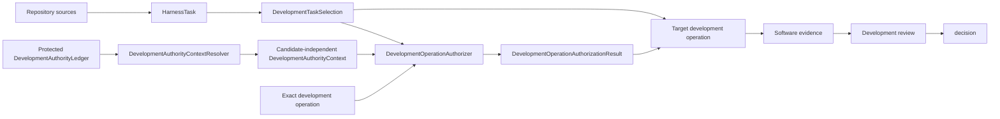

# Development control plane

## Responsibility

The development control plane governs software and documentation work. It owns:

- `HarnessTask` definitions;
- `DevelopmentTaskSelection`;
- development authorization;
- immutable unresolved and resolved/revised `DevelopmentDecision` records;
- software capabilities and resources;
- software-verification and repository-conformance findings;
- mechanical promotion-eligibility results; and
- development review and acceptance state.

It may reference immutable scientific contract or implementation identities. It does not store `WorkflowRun`, `ColoredPetriNetMarking`, calculator execution, scientific analysis or scientific-conclusion state.

## Authority model

Evidence supports a claim but grants no authority. Capability states what an implementation can do. `DevelopmentTaskSelection` states only repository-derived requested/selected work; it is neither authority nor permission. Repository-wide [development conformance](conformance.md) calculates mechanical eligibility from identified policy and authorization, but it does not create authority, create a human decision, or promote a repository change.

## Explicit context

Repository-sensitive operations receive an explicit repository root, source identities, exact selection and Task revisions, starting and candidate revisions, requested operation, permitted paths, operation requirements, architecture-policy identity, validator-profile identity, and candidate-independent `DevelopmentAuthorityContext`. `DevelopmentOperationAuthorizer` evaluates those exact values against the context and returns one immutable `DevelopmentOperationAuthorizationResult`: `authorized` identifies the exact matching unrevoked `TaskAuthorization`; `denied` records an established missing, stale, exhausted, revoked, or mismatched authorization; and `error` records that authorization or denial could not be established. A target operation may proceed only with the exact affirmative result and must verify its identity bindings without reinterpreting authority policy. Ambient discovery is not authority; a `HarnessTask`, selection, candidate decision, validation result, or candidate-controlled policy cannot authorize itself.

## Selection invariants

- At most one development selection is active within one declared control scope.
- Selection references an existing eligible `HarnessTask` revision but grants no authority or permission.
- Automatic successor activation is explicit and disabled by default.
- An unresolved human-owned decision prevents the affected transition.
- Generated projections cannot create or change selection.

## Human decisions and authority

Architecture, scope, dependencies, protected repository actions, review, and development acceptance remain human-owned where policy requires them. The single `DevelopmentDecision` model in `HarnessState` records explicit external input using unresolved and resolved variants/revisions. It preserves the exact request, question, options, scope, verbatim response, an unambiguous normalized declared outcome, source/authority identity, and applicable predecessor/supersession. Ambiguous, unmatched, or conflicting responses remain unresolved. A pending decision blocks only its declared development transition and scope. Processing is deterministic; silence, passing checks, reviewer agreement, elapsed time, or Task ordering does not provide a response. See [human decisions](../../human-decisions.md).

A decision record grants no authority. Candidate-independent authorization remains separately required, and the development decision system neither authorizes nor mutates scientific decision, execution, or disposition state.

## Unresolved issues

- Final wire format for `DevelopmentTaskSelection`.
- Whether selection is persisted with Task records or in a separate development control repository.
- Exact closed lifecycle vocabulary for routine versus reviewed development work.
- Whether multiple independent repository scopes may have concurrent selections.

## Protected authority ledger

`DevelopmentAuthorityLedger` is protected control-plane state separate from repository-derived `HarnessState`. It records identified policies, Task authorizations, eligibility-result references, review or promotion authorizations, revocations, predecessors, and issuing authority without manufacturing any of them.

`DevelopmentAuthorityContextResolver` receives the immutable selected `DevelopmentTrustConfiguration` and authority-ledger snapshot and returns closed `DevelopmentAuthorityContextResolutionResult`: `resolved` contains one usable candidate-independent `DevelopmentAuthorityContext`, while `failed` contains no context and at least one identified diagnostic. A target operation then receives the immutable context and exact affirmative `DevelopmentOperationAuthorizationResult`; only a resolved, unrevoked `TaskAuthorization` matching the exact selection and Task revisions, starting and candidate revisions, operation, and permitted paths permits that operation. The context identifies the trust configuration, ledger snapshot, resolution mode, and `DevelopmentAuthorityReconstructionReceipt`. Local resolution uses an explicitly selected local snapshot identity; CI resolution uses an explicitly selected protected CI snapshot identity. Neither mode may infer a snapshot from the candidate or current directory.

The context resolver authenticates the selected source as required by its trust configuration, verifies content identity and revision closure, reconstructs the ledger, and emits a receipt containing requested and resolved snapshot identities, trust-configuration identity, resolver version, authentication/content-verification outcomes, predecessor-closure result, and ordered diagnostics. Failure yields no usable context. The operation authorizer does not reconstruct the ledger, execute the target operation, mutate state, or broaden the exact authorization scope.

Ledger snapshot, trust-configuration, and receipt identities affect operation identity and provenance even when repository content is unchanged. Lossless ledger persistence has its own equivalence rule: reconstruction must preserve every authority record, ordering, predecessor, issuer, scope, and revocation fact. It is independent of `HarnessState` persistence equivalence. Concrete storage, signing, authentication mechanism, and transport remain deferred.
