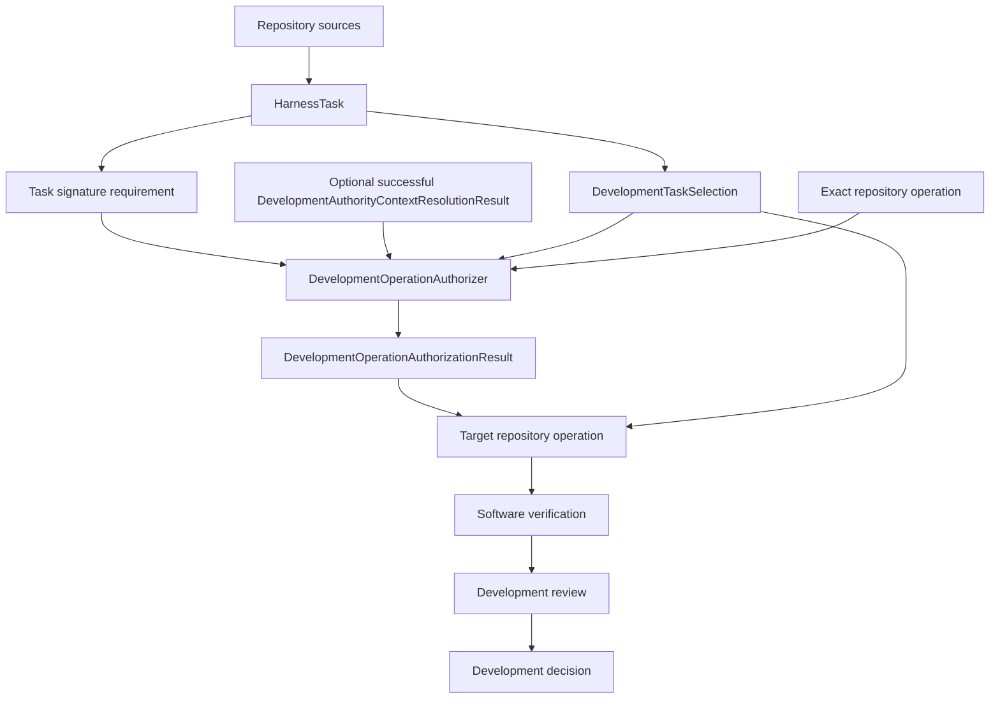
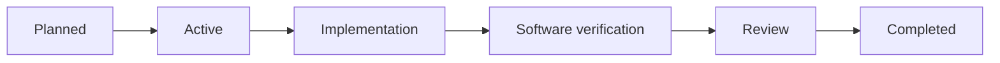

# `ksdft2effmass.harness` package

## Purpose

The development harness governs changes to software and human-authored documentation. It combines immutable work definitions, explicit selection and authority, repository operations, validation, persistence, and derived views without making those concerns interchangeable.

## Responsibility

The harness may reference immutable scientific contract and implementation identities when developing or verifying them. It does not store or advance `WorkflowRun`, execute a calculator as scientific workflow work, create `ScientificAnalysis` or record scientific acceptance.

| Concern | Owner |
|---|---|
| Work definition | `HarnessTask` |
| Active work | `DevelopmentTaskSelection` |
| Normalized state | `HarnessState` |
| Resolved configuration | `HarnessConfiguration`, composed from subsystem-owned configuration DataObjects |
| Source compilation | `HarnessCompiler` |
| Authority-context reconstruction | `DevelopmentAuthorityContextResolver` |
| Exact operation authorization | `DevelopmentOperationAuthorizer` |
| Domain validation | Concrete `HarnessDomainValidator` implementations |
| Normalized-state validation composition | `HarnessStateValidator` |
| Coding-standards conformance | Explicit coding-standard adapters returning the shared `ValidationResult` contract |
| Mechanical promotion eligibility | `PromotionEligibilityEvaluator` |
| Persistence | Domain-owned `HarnessStateRepository`; concrete `HarnessStateAtomicRepository` composed with shared `AtomicRevisionStore`, exact serializer, and validator |
| Derived views | `HarnessProjector`, `HarnessSynchronizer`, and `HarnessStateComparator` |
| Human conclusion | Immutable `DevelopmentDecision` unresolved/resolved variant or revision |
## Core boundaries

A `HarnessTask` defines bounded requested work, prerequisites, completion criteria, and exclusions. `DevelopmentTaskSelection` is repository-derived requested/selected work state; it is neither authority nor permission. Capability and selection do not authorize an operation or imply human acceptance. `DevelopmentAuthorityContextResolver` reconstructs and verifies the candidate-independent `DevelopmentAuthorityContext`; `DevelopmentOperationAuthorizer` returns an affirmative result only for a matching unrevoked `TaskAuthorization` covering the exact selection and Task revisions, candidate and starting revisions, operation, and permitted paths. A target operation verifies that result's exact bindings without reinterpreting authority policy. Neither a `HarnessTask`, selection, validation result, nor candidate-controlled decision can authorize itself.

Signature verification is opt-in per exact Task configuration and disabled by default.
A `signature_not_required` result records only that this optional gate was not selected;
it grants no authority. Required mode fails closed unless signed snapshot verification
produces a context bound to the exact accepted head.

`HarnessState` is the immutable complete selected-source aggregate used by validation and projection. Completeness means required selected source-family presence, not completed downstream semantic validation. Under evidence Option A, its evidence catalog retains exact `PythonModuleSource` paths/bytes and source identities only; Python conformance owns parsing, evidence owners, evidence IDs, and claim boundaries. It contains the one `DevelopmentDecision` model described by [human decisions](../../human-decisions.md) directly as an immutable canonically ordered sequence of unresolved and resolved variants/revisions. A pending decision blocks only its declared development transition and scope. Persistence stores lossless revisions of that same repository-derived aggregate. The initial realization composes `HarnessStateAtomicRepository` with an explicitly configured standard-library SQLite shared store; it does not introduce a domain SQLite subclass. Projections are recoverable read-only views and never replace authority.

[`HarnessConfiguration`](configuration.md) is the immutable resolved configuration supplied to application composition. It composes subsystem-owned Pi, human-review, persistence, conformance, resource, and catalog values. Exact source bindings and snapshot identity belong to `HarnessConfigurationResolutionResult`, not configuration equality or resolved JSON. Configuration selects no authority and contains no live service. Canonical JSON is the initial selected wire format; YAML remains deferred pending a separate wire and dependency decision.

Coding-standards conformance is owned by the harness and evaluates only explicitly identified source subjects under an identified coding-standards policy. Profiles bind policy requirements to explicit adapters but create no policy or gate. Task, behavioral, numerical, promotion, and scientific concerns remain with their existing owners.

Repository operations receive explicit roots, source identities, permitted paths, and requirements. Ambient current-directory discovery, mutable plugin registries, inherited architecture-policy subclasses, and silent implementation fallback are forbidden.

## Lifecycle

The exact route is proportional to risk. Human-owned and protected boundaries remain explicit. Automatic successor activation is disabled unless an explicit accepted contract enables it.

## Pages

- [Object model](object-model.md)
- [Configuration](configuration.md)
- [Development harness model](development-harness.md)
- [Compiler architecture](compiler-architecture.md)
- [Normalized-state validation](validation.md)
- [Coding-standards conformance](conformance.md)
- [Control plane](control-plane.md)
- [Persistence](persistence.md)
- [Shared revision persistence](../persistence/index.md)
- [Projections](projections.md)
- [Pi subagent boundary](subagents.md)
- [Human decisions](../../human-decisions.md)
- [Separation from the scientific workflow](../../separation-of-harness-and-workflow.md)

## Deferred implementation details

- Final submodule boundaries within `ksdft2effmass.harness`.
- Exact coding-standards policy, adapter-profile, aggregate-result, and report wire contracts.
- Closed development lifecycle vocabulary beyond the implemented compiler aggregate's opaque Task status.
- Exact HarnessState wire bytes and SQLite schema/operational policy; standard-library SQLite is selected only as the initial shared-store realization.
- Additional storage parameters and whether a demonstrated external consumer justifies a separate machine-readable JSON Schema; YAML remains deferred.
- Which generated development views remain maintained.
- Whether reusable repository-operation infrastructure belongs in the harness or application composition package.

## First-cohort reconciled contracts

Repository sources are the source of truth for requested work state and compile independently of authority to the complete immutable selected-source `HarnessState`; they do not grant operation authority or establish downstream evidence semantics. Unrepresentable normalization produces a failed closed-discriminant compilation result with no state, while representable cross-record defects remain available for validation. A separate protected `DevelopmentAuthorityLedger` is supplied through explicit candidate-independent context, and `DevelopmentOperationAuthorizer` returns the exact authorization outcome after compilation. One complete `ValidationResult` contract serves leaf and composite validation. Projector, comparator, and synchronizer verify exact validation and authorization bindings plus their own preconditions without a public harness-operation eligibility result; `PromotionEligibilityEvaluator` alone gates mechanical promotion. Task/selection, configuration, `DevelopmentDecision`, optional Task signature
requirements, signed authority verification, exact operation authorization, and the
version-1 complete `HarnessState` compiler boundary now have public foundations.
Validator, persistence, projection, and target-operation integration remain
prospective and separately owned.
