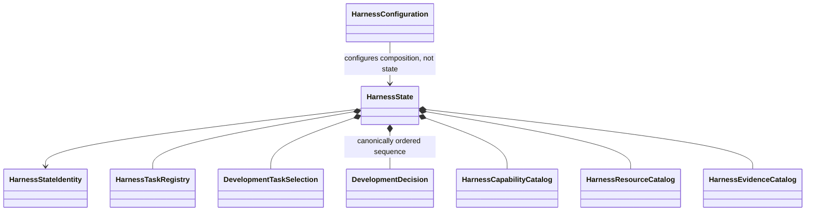

# Development harness object model

## Aggregate

`HarnessState` is the immutable normalized development-control aggregate. It contains `DevelopmentDecision` values directly as one immutable canonically ordered sequence, not through a catalog. Every component retains source provenance. It is not a database or generated artifact set.

## Primary records

| Object | Responsibility |
|---|---|
| `HarnessConfiguration` | Resolved composition aggregate containing subsystem-owned configuration values |
| `HarnessTask` | Bounded development work definition |
| `HarnessTaskRegistry` | Derived immutable index over canonical versioned Task definitions |
| `DevelopmentTaskSelection` | Explicit selected development work |
| `DevelopmentDecision` | One immutable model for explicit unresolved and resolved/revised human development decisions; see [human decisions](../../human-decisions.md) |
| `HarnessCapabilityCatalog` | Available development operations |
| `HarnessResourceCatalog` | Versioned resources and dependency closure |
| `HarnessEvidenceCatalog` | Exact selected `PythonModuleSource` paths/bytes and source identities; downstream conformance owns parsing, evidence owners, evidence IDs, and claim boundaries |

The implemented public `ksdft2effmass.harness` foundation realizes
``HarnessTaskRegistry`` as an in-memory aggregate derived exclusively from explicitly
supplied canonical ``HarnessTask`` records. It stores no independent child lists,
membership file, or topology. Direct-child and recursive-descendant queries derive
from canonical parent fields; descendant traversal is deterministic depth-first
pre-order and grants no execution order. ``DevelopmentTaskSelection`` has a project-
local version-1 wire contract containing only the active Task reference, explicit
activation-receipt references, and the disabled automatic-successor policy. Temporary
`harness.pi.local` imports resolve to the same public objects during migration.
Neither record grants authority. The public foundation also implements
`DevelopmentDecision`, its option and exact source-provenance records, and a strict
canonical serializer with one-way legacy adaptation.

The version-1 compiler contract composes these existing values with explicit typed
capability, resource, agent-definition, and evidence sources into one complete
selected-source ``HarnessState``. Completeness means that every required selected
source family is present, not that graph, evidence-owner, evidence-ID, claim-boundary,
or other downstream validation has passed. Evidence Option A retains exact
``PythonModuleSource`` paths/bytes and source identities only; Python conformance owns
its later parsing and semantic findings. The source snapshot and aggregate preserve
provenance without copying configuration or authority state. Exact source, result,
catalog, and state fields are documented by the public classes and the
[compiler architecture](compiler-architecture.md).

Each `DevelopmentDecision` owns its intrinsic field and unresolved/resolved variant invariants. `HarnessStateValidator` and normalization own cross-record identity uniqueness, predecessor/supersession and other references, and canonical sequence ordering. Loading, other cross-object validation, serialization, persistence, selection, and projection belong to ActionObjects. No development-decision-specific public ActionObject is introduced.

`HarnessConfiguration` is separate from `HarnessState`: configuration controls application composition but is not development lifecycle state or authority. It composes concrete `PiHarnessConfiguration`, `HumanReviewConfiguration`, `HarnessPersistenceConfiguration`, `PythonConformanceConfiguration`, `HarnessResourceConfiguration`, and `HarnessCatalogConfiguration` DataObjects. Ordered source bindings and snapshot identity belong to `HarnessConfigurationResolutionResult`, not to configuration equality or resolved JSON. Resolution, aggregate validation, and canonical JSON conversion belong to the ActionObjects defined by the [configuration contract](configuration.md); no generic configuration protocol is introduced.

## Results and actions

`HarnessSourceLoadResult`, `HarnessCompilationResult`, `ValidationResult`, `DevelopmentPrerequisiteResolutionResult`, `DevelopmentTaskSignatureRequirementResult`, `DevelopmentAuthorityContextResolutionResult`, `DevelopmentOperationAuthorizationResult`, `HarnessProjectionResult`, `SynchronizationResult`, `ComparisonResult`, and persistence results are immutable outcomes. The loader, compiler, validators, prerequisite resolver, authority-context resolver, operation authorizer, projector, synchronizer, comparator, serializers, and repositories are explicit ActionObjects.

The implemented prerequisite boundary uses a consumer-scoped immutable
`DevelopmentPrerequisiteContract` sidecar bound to one exact `HarnessTask` content
identity. Requirements name owner, result kind, claim, producer revision, and retention
boundary and the single accepted `effective_not_revoked` lineage policy;
owner-retained result references preserve content identity and effective, superseded,
or revoked lineage without copying result payloads. Every observation, including
absent, unavailable, and indeterminate observations, binds the exact owner and
retention boundary. The fieldless `DevelopmentPrerequisiteResolver` consumes only
explicit Task, contract, and complete owner-observation inputs. It returns closed
per-edge outcomes and a satisfied aggregate only when every declared Task and external
edge has one exact effective match and no aggregate diagnostic exists. It performs no
status inference, loading, persistence, selection, activation, authorization, or
successor choice.

Coding-standards conformance consumes an identified source subject, coding-standards policy, applicable adapter profile, and explicit coding-standard adapters and returns the shared immutable `ValidationResult` values plus a derived report. Exact public names remain deferred. Promotion eligibility, Task authorization, human review, and repository mutation remain separate owners.

Project specialization uses an explicit policy and validator composition rather than subclassing a nominal base conformance architecture. Structural validator protocols are introduced only when multiple implementations demonstrate polymorphic need.

The implemented authority-plane object family includes exact immutable Task signature
configuration and requirement results, trust anchors and configuration, signed
snapshots and ledger records, reconstruction receipts and contexts, exact operation
bindings, and closed authorization results. Serializers own their strict wires;
resolvers and the authorizer own behavior. The unsigned default performs no
cryptographic import and claims no authority.

## Deferred implementation details

- Closed status vocabulary for `HarnessTask`.
- Exact coding-standards subject, policy, adapter-profile, aggregate-result, and report contracts.

## Authority and compilation boundaries

`HarnessCompilationResult` is a closed `succeeded`/`failed` union: success contains exactly one complete repository-derived `HarnessState` and no blocking compilation diagnostic; failure contains no state and at least one blocking diagnostic because one complete unique normalized state could not be constructed. Both variants identify sources, compiler/normalization versions, and ordered diagnostics; neither identifies authority context, ledger state, authorization, requested operation, or permitted paths. Representable cross-record defects remain available in successful state for `HarnessStateValidator` to report. `DevelopmentDecision` revisions remain append-only within `HarnessState`; correction uses predecessor/supersession rather than mutation. `DevelopmentAuthorityLedger` remains separate protected control-plane state and is never a second harness aggregate. `DevelopmentOperationAuthorizationResult` records exact `signature_not_required`, `authorized`, `denied`, or `error` outcomes after compilation and changes neither state nor state identity. A decision or validation record grants no authority.
