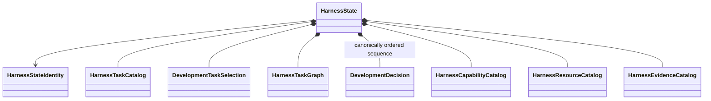

# Development harness object model

## Aggregate

`HarnessState` is the immutable normalized development-control aggregate. It contains `DevelopmentDecision` values directly as one immutable canonically ordered sequence, not through a catalog. Every component retains source provenance. It is not a database or generated artifact set.

## Primary records

| Object | Responsibility |
|---|---|
| `HarnessTask` | Bounded development work definition |
| `HarnessTaskCatalog` | Unique versioned Task definitions |
| `DevelopmentTaskSelection` | Explicit selected development work |
| `HarnessTaskGraph` | Typed parent and prerequisite relationships |
| `DevelopmentDecision` | One immutable model for explicit unresolved and resolved/revised human development decisions; see [human decisions](../../human-decisions.md) |
| `HarnessCapabilityCatalog` | Available development operations |
| `HarnessResourceCatalog` | Versioned resources and dependency closure |
| `HarnessEvidenceCatalog` | Evidence identities, owners, and claim boundaries |

Each `DevelopmentDecision` owns its intrinsic field and unresolved/resolved variant invariants. `HarnessStateValidator` and normalization own cross-record identity uniqueness, predecessor/supersession and other references, and canonical sequence ordering. Loading, other cross-object validation, serialization, persistence, selection, and projection belong to ActionObjects. No development-decision-specific public ActionObject is introduced.

## Results and actions

`HarnessSourceLoadResult`, `HarnessCompilationResult`, `ValidationResult`, `DevelopmentAuthorityContextResolutionResult`, `DevelopmentOperationAuthorizationResult`, `HarnessProjectionResult`, `SynchronizationResult`, `ComparisonResult`, and persistence results are immutable outcomes. The loader, compiler, validators, authority-context resolver, operation authorizer, projector, synchronizer, comparator, serializers, and repositories are explicit ActionObjects.

Coding-standards conformance consumes an identified source subject, coding-standards policy, applicable adapter profile, and explicit coding-standard adapters and returns the shared immutable `ValidationResult` values plus a derived report. Exact public names remain deferred. Promotion eligibility, Task authorization, human review, and repository mutation remain separate owners.

Project specialization uses an explicit policy and validator composition rather than subclassing a nominal base conformance architecture. Structural validator protocols are introduced only when multiple implementations demonstrate polymorphic need.

## Deferred implementation details

- Exact field contracts for `HarnessStateIdentity` and source provenance.
- Closed status vocabulary for `HarnessTask`.
- Exact coding-standards subject, policy, adapter-profile, aggregate-result, and report contracts.
- Whether capabilities and resources are separate catalogs or one composed immutable capability model.

## Authority and compilation boundaries

`HarnessCompilationResult` is a closed `succeeded`/`failed` union: success contains exactly one complete repository-derived `HarnessState` and no blocking compilation diagnostic; failure contains no state and at least one blocking diagnostic because one complete unique normalized state could not be constructed. Both variants identify sources, compiler/normalization versions, and ordered diagnostics; neither identifies authority context, ledger state, authorization, requested operation, or permitted paths. Representable cross-record defects remain available in successful state for `HarnessStateValidator` to report. `DevelopmentDecision` revisions remain append-only within `HarnessState`; correction uses predecessor/supersession rather than mutation. `DevelopmentAuthorityLedger` remains separate protected control-plane state and is never a second harness aggregate. `DevelopmentOperationAuthorizationResult` records exact `authorized`, `denied`, or `error` outcomes after compilation and changes neither state nor state identity. A decision or validation record grants no authority.
