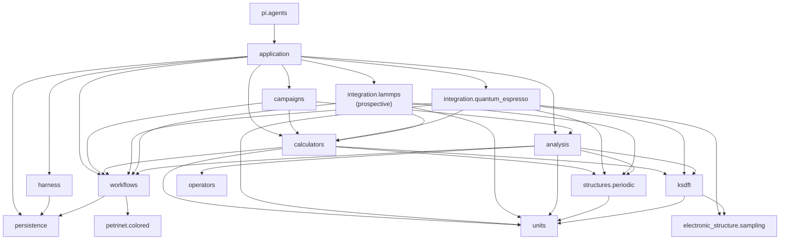

# `ksdft2effmass` prospective package architecture

Architecture v2 is organized by the selected prospective Python namespace. This
layout documents package ownership without claiming that the packages are
implemented or authorizing a source move.

## Package map

The reverse `petrinet.colored → workflows` dependency is forbidden.

## Package ownership

| Prospective package | Architecture page | Responsibility |
|---|---|---|
| `ksdft2effmass.application` | [Application](application/index.md) | Explicit composition root |
| `ksdft2effmass.persistence` | [Persistence](persistence/index.md) | Domain-neutral immutable revision storage |
| `ksdft2effmass.harness` | [Harness](harness/index.md) | Development-harness contracts and control |
| `ksdft2effmass.workflows` | [Workflows](workflows/index.md) | Scientific Task, Workflow, run, and control contracts |
| `ksdft2effmass.petrinet.colored` | [Colored Petri net](petrinet/colored/index.md) | Generic deterministic CPN values and pure operations |
| `ksdft2effmass.campaigns` | [Campaigns](campaigns/index.md) | Project-specific QoI-study and Workflow composition definitions |
| `ksdft2effmass.calculators` | [Calculators](calculators/index.md) | Shared plane-wave specification and calculator-facing simulation contracts |
| `ksdft2effmass.integration.quantum_espresso` | [Quantum ESPRESSO integration](integration/quantum_espresso/index.md) | Canonical QE-native contracts, loose grouped `pw.x` input writing, QEXSD parsing, diagnostics, and concrete anti-corruption actions |
| `ksdft2effmass.integration.lammps` (prospective) | [QoI-first LAMMPS integration](qoi-first-lammps-integration.md) | LAMMPS-native contracts and adapters defined only after calculator-independent QoI and atomistic requirements; no Simulation Task is implemented |
| `ksdft2effmass.structures` | [Structures](structures/index.md) | Application-owned physical structure namespace |
| `ksdft2effmass.structures.periodic` | [Periodic structures](structures/periodic.md) | Neutral periodic crystal geometry semantics |
| `ksdft2effmass.electronic_structure` | [Periodic structures and sampling](structures/periodic.md) | Electronic reciprocal-space sampling semantics |
| `ksdft2effmass.units` | [Canonical units and conversion provenance](units.md) | Canonical metal-unit identities, pinned conversion definitions, typed scalar conversions, and their provenance |
| `ksdft2effmass.periodic` | [Compatibility package](periodic/index.md) | Temporary re-export of the former public periodic inventory |
| `ksdft2effmass.ksdft` | [Kohn–Sham DFT](ksdft/index.md) | Representation-neutral Kohn–Sham semantics |
| `ksdft2effmass.operators` | [Represented operators](operators/index.md) | Finite represented-operator records, serialization, exact compatibility, and narrowly fixed-representation operations |
| `ksdft2effmass.analysis` | [Analysis](analysis/index.md) | Higher-level deterministic scientific analysis |
| `ksdft2effmass.pi.agents` | [Pi agents](pi/agents/index.md) | Outer deterministic Pi request/result adapter |

No additional shared `contracts` package sits beneath these owners. Cross-package
identity/version/failure semantics are defined at the architecture root, while each
listed package owns its nominal runtime values and outward consumers own explicit
boundary adaptation.

## Documentation boundary

Package-wide diagrams and discussions live on the nearest package `index.md`;
the [`petrinet` namespace page](petrinet/index.md) provides the parent boundary
for the selected `petrinet.colored` subpackage. The [`pi` namespace
page](pi/index.md) provides the outer integration boundary for the selected
`pi.agents` subpackage.
Topic pages below a package remain package-level architecture unless the owning
architecture explicitly selects an internal module. Architecture v2 currently
defers exact internal submodules and public wire exports, so documentation
filenames must not be interpreted as approved source modules.

Repository-wide principles, human-decision semantics, identity contracts,
dependency direction, issues, and cross-domain separation remain at the
[Architecture v2 root](../index.md).
