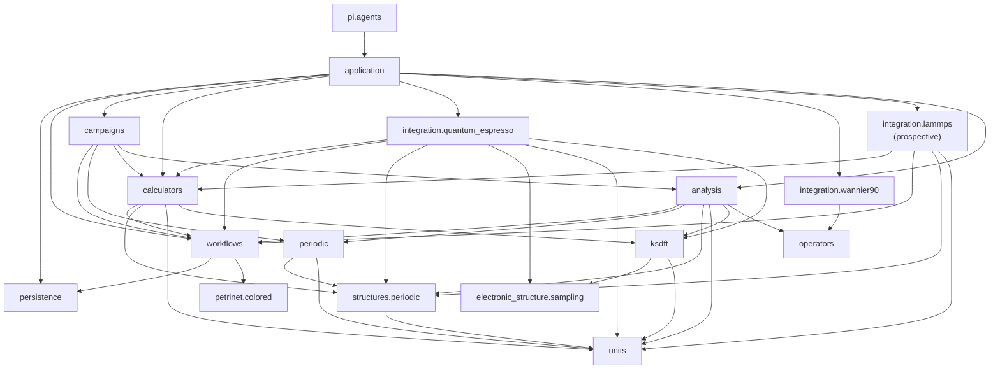

# `ksdft2effmass` prospective package architecture

Architecture v2 is organized by the selected prospective Python namespace. This
layout documents package ownership without claiming that the packages are
implemented or authorizing a source move.

## Package map


```mermaid
flowchart TB
    app["application"]
    persistence["persistence"]
    workflows["workflows"]
    petrinet["petrinet.colored"]
    campaigns["campaigns"]
    periodic["periodic"]
    calculators["calculators"]
    qe_integration["integration.quantum_espresso"]
    wannier90_integration["integration.wannier90"]
    lammps_integration["integration.lammps<br/>(prospective)"]
    structures["structures.periodic"]
    sampling["electronic_structure.sampling"]
    units["units"]
    ksdft["ksdft"]
    operators["operators"]
    analysis["analysis"]
    pi_agents["pi.agents"]

    pi_agents --> app
    app --> persistence
    app --> workflows
    app --> campaigns
    app --> calculators
    app --> qe_integration
    app --> wannier90_integration
    app --> lammps_integration
    app --> analysis
    workflows --> persistence
    workflows --> petrinet
    campaigns --> workflows
    campaigns --> periodic
    campaigns --> calculators
    campaigns --> analysis
    calculators --> workflows
    calculators --> structures
    calculators --> units
    calculators --> ksdft
    qe_integration --> calculators
    qe_integration --> workflows
    qe_integration --> structures
    qe_integration --> sampling
    qe_integration --> units
    qe_integration --> ksdft
    wannier90_integration --> operators
    lammps_integration --> calculators
    lammps_integration --> workflows
    lammps_integration --> structures
    lammps_integration --> units
    analysis --> workflows
    analysis --> periodic
    analysis --> structures
    analysis --> units
    analysis --> ksdft
    periodic --> structures
    periodic --> units
    structures --> units
    ksdft --> sampling
    ksdft --> units
    analysis --> operators
```

The reverse `petrinet.colored → workflows` dependency is forbidden.

## Package ownership

| Prospective package | Architecture page | Responsibility |
|---|---|---|
| `ksdft2effmass.application` | [Application](application/index.md) | Explicit composition root |
| `ksdft2effmass.persistence` | [Persistence](persistence/index.md) | Domain-neutral immutable revision storage |
| `ksdft2effmass.serialization` | [Serialization](serialization/index.md) | Type-preserving abstract JSON wire contracts |
| `ksdft2effmass.workflows` | [Workflows](workflows/index.md) | Scientific Task, Workflow, run, and control contracts |
| `ksdft2effmass.petrinet.colored` | [Colored Petri net](petrinet/colored/index.md) | Generic deterministic CPN values and pure operations |
| `ksdft2effmass.campaigns` | [Campaigns](campaigns/index.md) | Project-specific QoI-study and Workflow composition definitions |
| `ksdft2effmass.calculators` | [Calculators](calculators/index.md) | Shared plane-wave specification and calculator-facing simulation contracts |
| `ksdft2effmass.integration.quantum_espresso` | [Quantum ESPRESSO integration](integration/quantum_espresso/index.md) | Canonical QE-native contracts, loose grouped `pw.x` input writing, QEXSD parsing, diagnostics, and concrete anti-corruption actions |
| `ksdft2effmass.integration.wannier90` | [Wannier90 integration](integration/wannier90/index.md) | Execution-independent typed adaptation of retained native Wannier90 gauge matrices, Hamiltonian blocks, and final localization observations |
| `ksdft2effmass.integration.lammps` (prospective) | [QoI-first LAMMPS integration](qoi-first-lammps-integration.md) | LAMMPS-native contracts and adapters defined only after calculator-independent QoI and atomistic requirements; no Simulation Task is implemented |
| `ksdft2effmass.structures` | [Structures](structures/index.md) | Application-owned physical structure namespace |
| `ksdft2effmass.structures.periodic` | [Periodic structures](structures/periodic.md) | Neutral periodic crystal geometry semantics |
| `ksdft2effmass.electronic_structure` | [Periodic structures and sampling](structures/periodic.md) | Electronic reciprocal-space sampling semantics |
| `ksdft2effmass.units` | [Canonical units and conversion provenance](units.md) | Canonical metal-unit identities, pinned conversion definitions, typed scalar conversions, and their provenance |
| `ksdft2effmass.periodic` | [General periodic-model architecture](periodic/index.md) | Implemented nominal 1D--3D scientific-model hierarchy and toy-model catalog contract; transitional compatibility exports remain pending migration, and cross-dimensional comparison is prospective |
| `ksdft2effmass.ksdft` | [Kohn–Sham DFT](ksdft/index.md) | Representation-neutral Kohn–Sham semantics |
| `ksdft2effmass.operators` | [Represented operators](operators/index.md) | Finite represented-operator records, serialization, exact compatibility, and narrowly fixed-representation operations |
| `ksdft2effmass.analysis` | [Analysis](analysis/index.md) | Higher-level deterministic scientific analysis |

No additional shared `contracts` package sits beneath these owners. Cross-package
identity/version/failure semantics are defined at the architecture root, while each
listed package owns its nominal runtime values and outward consumers own explicit
boundary adaptation.

## Extraction records

- [General periodic-model architecture](periodic/index.md)
- [Appendix G periodic-1D capability extraction inventory](periodic-1d-capability-extraction-inventory.md)
- [Periodic2d capability-parity gate](periodic2d-capability-parity.md)
- [Periodic-1D defect campaign integration](periodic-1d-defect-campaign-integration.md)
- [Periodic native-evidence presence audit](periodic-native-evidence-presence-audit.md)
- [Sparse and nonuniform Fourier-transform technology review](sparse-fourier-transform-technology-review.md)
- [Research-monograph software-extraction audit](research-monograph-software-extraction-audit.md)
- [Living-monograph current-library capability crosswalk](../../../publications/research-monograph/current-library-capability-crosswalk.md)
  (publication-side consumer of the architecture and extraction records)

```{toctree}
:hidden:

periodic/index
periodic-1d-capability-extraction-inventory
periodic2d-capability-parity
periodic-1d-defect-campaign-integration
periodic-native-evidence-presence-audit
sparse-fourier-transform-technology-review
research-monograph-software-extraction-audit
integration/wannier90/index
serialization/index
```

## Documentation boundary

The [architecture documentation standard](../documentation/index.md) defines canonical
pages for each supported package, subpackage, module, and public class. Package-wide
diagrams and discussions live on the nearest package `index.md`; the [`petrinet`
namespace page](petrinet/index.md) provides the parent boundary for the selected
`petrinet.colored` subpackage. Topic pages below a package remain package-level
architecture unless the owning architecture explicitly selects an internal module.
Only `<module>/index.md` and `<module>/<ClassName>/index.md` establish canonical source
mirrors; a topic filename or import re-export does not.

Repository-wide principles, human-decision semantics, documentation standards,
identity contracts, dependency direction, and issues remain at the
[Architecture v2 root](../index.md).
