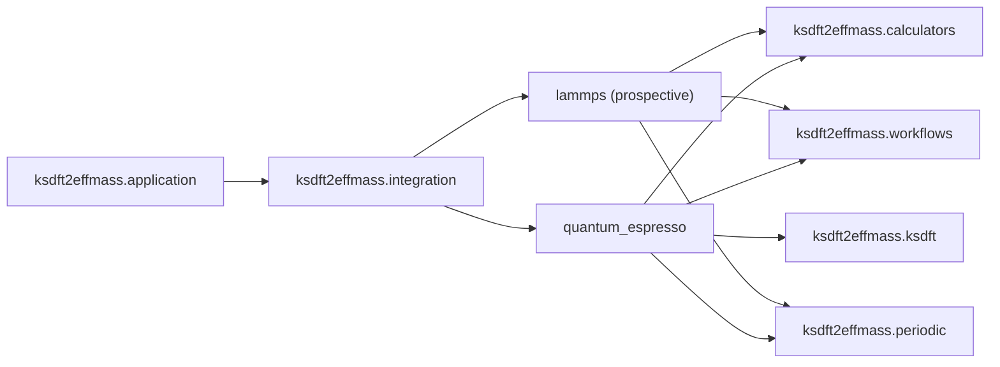

# `ksdft2effmass.integration` package

The `ksdft2effmass.integration` namespace contains concrete anti-corruption
boundaries for explicitly selected external systems. Its first implemented surface is
the loose Quantum ESPRESSO `pw.x` input writer, which consumes upstream-selected
opaque groups without importing a calculator execution model. The prospective
[LAMMPS boundary](../qoi-first-lammps-integration.md) adopts a QoI-first definition
order but does not yet define or implement a LAMMPS Simulation Task. Future adapters
implement consumer-owned contracts and remain downstream of the packages whose
contracts they consume.

- [Quantum ESPRESSO integration](quantum_espresso/index.md)
- [QoI-first calculator integration and LAMMPS](../qoi-first-lammps-integration.md)

Additional integrations require demonstrated project need and separately selected
contracts. The current LAMMPS work selects ordering and ownership only; exact public
contracts and execution remain deferred. This namespace is not a runtime plugin
registry.
