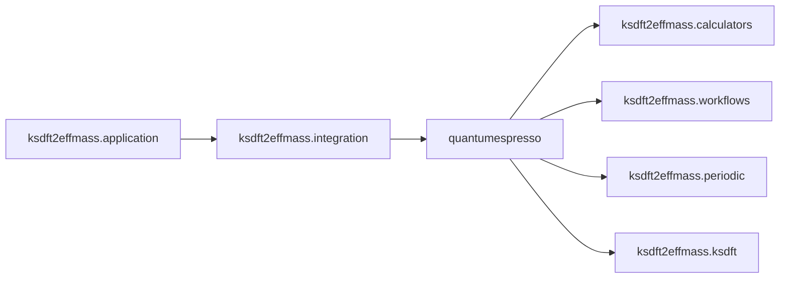

# `ksdft2effmass.integration` package

The prospective `ksdft2effmass.integration` namespace contains concrete
anti-corruption adapters for explicitly selected external systems. Integrations
implement consumer-owned contracts and remain downstream of the packages whose
contracts they consume.

- [Quantum ESPRESSO integration](quantumespresso/index.md)

Additional integrations require demonstrated project need and separately
selected contracts. This namespace is not a runtime plugin registry.
