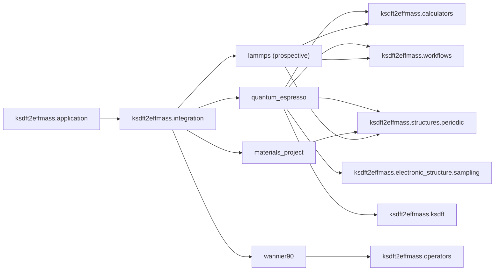

# `ksdft2effmass.integration` package

The `ksdft2effmass.integration` namespace contains concrete anti-corruption
boundaries for explicitly selected external systems. Its first implemented surface is
the loose Quantum ESPRESSO `pw.x` input writer, which consumes upstream-selected
opaque groups without importing a calculator execution model. The implemented
[Wannier90 boundary](wannier90/index.md) parses explicit caller-supplied native artifact
bytes without owning localization or execution. The implemented Materials Project
boundary retrieves an explicit public material identity through MPRester and
immediately converts the mutable pymatgen structure into immutable project-owned
metal-unit geometry. Its local symmetry adapter maps an exact canonical snapshot to a
structures-owned record with explicit tolerances and pymatgen version; symmetry
algorithms remain owned by pymatgen. The prospective
[LAMMPS boundary](../qoi-first-lammps-integration.md) adopts a QoI-first definition
order but does not yet define or implement a LAMMPS Simulation Task. Future adapters
implement consumer-owned contracts and remain downstream of the packages whose
contracts they consume.

- [Quantum ESPRESSO integration](quantum_espresso/index.md)
- [Wannier90 integration](wannier90/index.md)
- Materials Project integration: public Python API documented under
  [periodic records](../../../../api/periodic-records.rst)
- [QoI-first calculator integration and LAMMPS](../qoi-first-lammps-integration.md)

Additional integrations require demonstrated project need and separately selected
contracts. The current LAMMPS work selects ordering and ownership only; exact public
contracts and execution remain deferred. This namespace is not a runtime plugin
registry.
