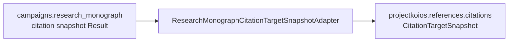

# `ksdft2effmass.integration.projectkoios` package

The optional `ksdft2effmass.integration.projectkoios` package is the target-side
anti-corruption boundary from one exact replay-valid research-monograph citation
Result to the canonical neutral target DTOs exported by
`projectkoios.references.citations`.

The dependency direction is one way: this integration package imports the citation
owner and Project Koios References; neither owner imports this integration package,
and References does not import `ksdft2effmass`. The optional package extra pins exact
Project Koios and References Git revisions. Core `ksdft2effmass` users do not acquire
those dependencies by default.

The adapter first replays the complete owner Result through
`ResearchMonographCitationSnapshotIntegrityValidator`. It then preserves literal
case-sensitive keys, owner order, target-owned identities, content identities,
excerpt-free locators, occurrences, groups, bibliography entries, source gaps, and
closure tuples. The only deliberate field renames are
`bibliography_entry_id` to `entry_id` and `bibliography_path` to
`bibliography_source_path`.

The reduced target boundary excludes source-file, include, call, todo, request,
Result, parser, generator, and repository-revision records. It leaves
`source_bibliography_observation_id` absent (`None`) until the References owner has
independently parsed exact bibliography bytes and established a binding. It adds no
bibliography intake, raw BibTeX, manuscript rescan, acquisition, identity decision,
availability evidence, rights or use state, processing authority, document
projection, or projection status. It performs no file I/O and owns no reverse adapter.
