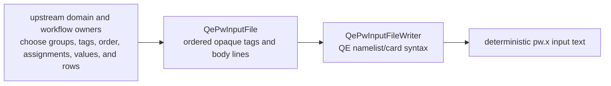

# `ksdft2effmass.integration.quantum_espresso` package

This canonical package is the concrete Quantum ESPRESSO anti-corruption boundary.
The accepted
[package-ownership decision](../../calculators/quantum-espresso-package-ownership-decision.md)
places every QE-specific contract and implementation here and the backend-neutral
plane-wave DFT port in `ksdft2effmass.calculators.dft.pw`.

Its first implemented capability represents and writes grouped `pw.x` input without
defining a comprehensive model of Quantum ESPRESSO variables or scientific settings.

## Implemented `pw.x` input boundary

`QePwInputFile` is an immutable, loose native-input DataObject. It preserves an
ordered tuple of grouping tags and body lines. A tag beginning with `&` denotes a
Fortran namelist; another tag denotes a QE card and may include its card option.
Unknown tags and body content are retained. The object does not know the catalog of
`pw.x` variables, choose a group, supply a default, normalize a value, validate
cross-field physics, or own pseudopotential and calculation provenance.

`QePwInputFileWriter` is the corresponding ActionObject. It supplies only the
mechanical namelist/card delimiters, indentation, ordering, and final newline. It
does not stage files, encode text to bytes, invoke `pw.x`, or claim that the emitted
input is accepted by any Quantum ESPRESSO version. Upstream objects remain responsible
for every grouping and scientific choice.

The retained silicon SCF example under
`examples/tutorials/silicon-scf/qe/` demonstrates this boundary using portable paths.
It is a software-writing example, not a new calculation, provenance record,
numerical-verification result, or scientific validation result.

## Implemented downstream boundaries and staged observation adaptation

QEXSD begins on the output side. The existing
`integration.quantum_espresso.qexsd` package mechanically parses explicit QEXSD bytes
after an independently obtained output artifact exists. It accepts exactly the
observed QEXSD `23.03.10` and `25.05.21` formats under the QES 1.0 namespace and
fails closed for unlisted versions. This bounded support does not claim exhaustive
coverage of either upstream schema. QEXSD does not define the input grouping model,
drive `QePwInputFileWriter`, or serve as the primary integration boundary.

Staging, isolated workspace and one-attempt process invocation, mechanical capture,
artifact discovery, failure mapping, operation-specific results, and Workflow dispatch
adaptation are implemented as separate integration-owned ActionObjects. The accepted
[QE diagnostic outcome and retry decision](../../calculators/quantum-espresso-diagnostic-outcome-decision.md)
assigns executable- and version-bound diagnostic classification over exact independent
stdout and stderr artifacts to this integration while leaving dependency admission and
retry control with Workflow composition. The
[local-execution implementation contract](../../calculators/quantum-espresso-local-execution-contract.md)
fixes the implemented public Python DataObject, ResultObject, ActionObject,
confinement, capture, diagnostic, private-record, and Workflow-handoff boundaries.
These responsibilities consume exact written or retained inputs without moving
grouping or scientific policy into this package. The integration-owned first stage of
human-selected Option C is implemented and human-accepted as a bounded software
contract: `QuantumEspressoObservationAdapter`
requires one `QuantumEspressoParsedDocumentRecord` binding the exact QEXSD document,
source-content identity, parser implementation and parser version, plus an admitted
`ArtifactManifest` entry, reserved result identity, and supported normalization
policy/version. It rejects missing entries, byte-identity disagreement, unsupported
parser, native format or semantic
role, unsupported policy, and neutral-contract incompatibility without a partial
observation. Success retains the unchanged schema-version-1 neutral plane-wave record,
exact source and producer identities, parsed-document and parser identities, policy,
and explicit limitations in `QuantumEspressoExtractedObservationResult`. Every closed
failure retains the reserved result identity and the same manifest, entry,
parsed-document, source-content, parser, and policy correlation. The separately owned
Workflow stage consumes the exact immutable extracted result through its
calculator-independent `NormalizedObservationSource` protocol and assembles the
Workflow-owned `NormalizedObservationSet`; integration remains unaware of that
protocol and result owner.

```mermaid
flowchart LR
    written["written or retained exact input"] --> stage["identity-checked staging"]
    stage --> process["separately authorized local process"]
    process --> capture["mechanical output capture<br/>independent stdout/stderr artifacts"]
    capture --> diagnostics["version-bound QE diagnostic classification"]
    diagnostics --> result["typed operation-specific calculator result"]
    result --> native["post-ingress native output and/or QEXSD parsing"]
    native --> adapt["integration-owned extracted observation<br/>exact artifact and policy correlation"]
    adapt --> normalized["Workflow-owned NormalizedObservationSet<br/>typed exact-source assembly"]
```

The generic port, concrete object model, and protected execution boundary are
described in
[Quantum ESPRESSO integration architecture](../../calculators/quantum-espresso.md).
This integration owns QE-native meaning but no Workflow authority, generic
plane-wave DFT meaning, or scientific acceptance policy. Nothing in this architecture
authorizes Quantum ESPRESSO execution, dependency changes, pseudopotential selection,
or external computation.
