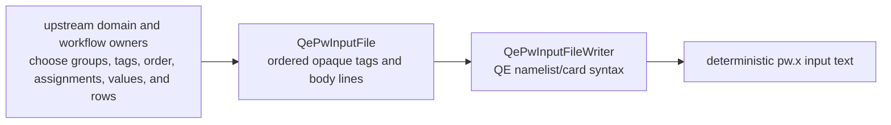
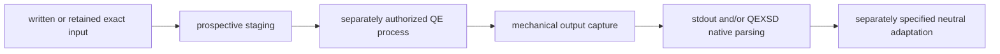

# `ksdft2effmass.integration.quantumespresso` package

This package is the concrete Quantum ESPRESSO anti-corruption boundary. Its first
implemented capability is deliberately smaller than the prospective execution
architecture: it represents and writes grouped `pw.x` input without defining a
comprehensive model of Quantum ESPRESSO variables or scientific settings.

## Implemented `pw.x` input boundary

`QePwInputFile` is an immutable, loose native-input DataObject. It preserves an
ordered tuple of grouping tags and body lines. A tag beginning with `&` denotes a
Fortran namelist; another tag denotes a QE card and may include its card option.
Unknown tags and body content are retained. The object does not know the catalog of
`pw.x` variables, choose a group, supply a default, normalize a value, validate
cross-field physics, or own pseudopotential and calculation provenance.

`QePwInputFileWriter` is the corresponding ActionObject. It supplies only the
mechanical namelist/card delimiters, indentation, ordering, and final newline. It
does not stage files, encode text to bytes, invoke `pw.x`, or claim that the emitted
input is accepted by any Quantum ESPRESSO version. Upstream objects remain responsible
for every grouping and scientific choice.

The retained silicon SCF example under
`examples/quantum_espresso/scf_tutorial/` demonstrates this boundary using portable
paths. It is a software-writing example, not a new calculation, provenance record,
numerical-verification result, or scientific validation result.

## Downstream and prospective boundaries

QEXSD begins on the output side. The existing
`integration.quantumespresso.qexsd` package mechanically parses explicit QEXSD bytes
after an independently obtained output artifact exists. It accepts exactly the
observed QEXSD `23.03.10` and `25.05.21` formats under the QES 1.0 namespace and
fails closed for unlisted versions. This bounded support does not claim exhaustive
coverage of either upstream schema. QEXSD does not define the input grouping model,
drive `QePwInputFileWriter`, or serve as the primary integration boundary.

Staging, isolated workspace and process invocation, mechanical capture, artifact
discovery, failure mapping, and adaptation into neutral observations remain separate
prospective responsibilities. If implemented, they consume exact written or retained
inputs without moving grouping or scientific policy into this package.

The calculator-facing object model and protected execution boundary are described in
[Quantum ESPRESSO calculator architecture](../../calculators/quantum-espresso.md).
This integration owns no Workflow authority, scientific acceptance policy, or
calculator-domain meaning. Nothing in this architecture authorizes Quantum ESPRESSO
execution, dependency changes, pseudopotential selection, or external computation.
