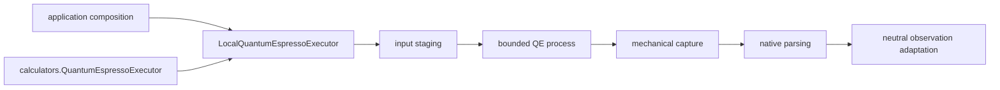

# `ksdft2effmass.integration.quantumespresso` package

This prospective package owns concrete Quantum ESPRESSO serialization, staging,
isolated workspace and process invocation, mechanical capture, native parsing,
artifact discovery, failure mapping, and adaptation into neutral observations.
It implements calculator-owned executor contracts and is selected only by
application composition.

The calculator-facing object model and the complete execution boundary are
described in [Quantum ESPRESSO calculator architecture](../../calculators/quantum-espresso.md).
The integration owns no Workflow authority, scientific acceptance policy, or
calculator-domain meaning. Its prospective status authorizes no QE execution.
Exact internal modules remain deferred.
