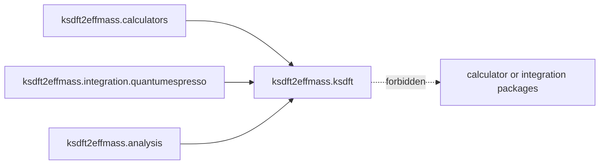

# `ksdft2effmass.ksdft` package

The prospective `ksdft2effmass.ksdft` package owns representation-neutral
Kohn–Sham observation semantics. It remains distinct from calculator-native
records, workflow state, and physical interpretation beyond the accepted
Kohn–Sham contract.

No page in this package identifies Kohn–Sham eigenvalues with a complete
many-body excitation spectrum. Architecture v2 does not yet select exact
internal modules or public wire exports.
