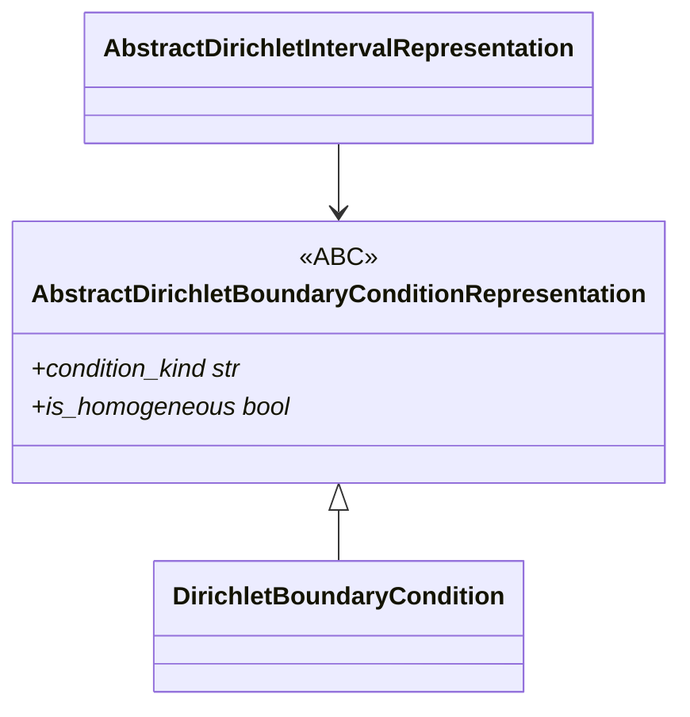

# `AbstractDirichletBoundaryConditionRepresentation` schematic

```mermaid
classDiagram
    class AbstractDirichletBoundaryConditionRepresentation {
        <<ABC>>
        +condition_kind str*
        +is_homogeneous bool*
    }
    class DirichletBoundaryCondition
    class AbstractDirichletIntervalRepresentation

    AbstractDirichletBoundaryConditionRepresentation <|-- DirichletBoundaryCondition
    AbstractDirichletIntervalRepresentation --> AbstractDirichletBoundaryConditionRepresentation
```
