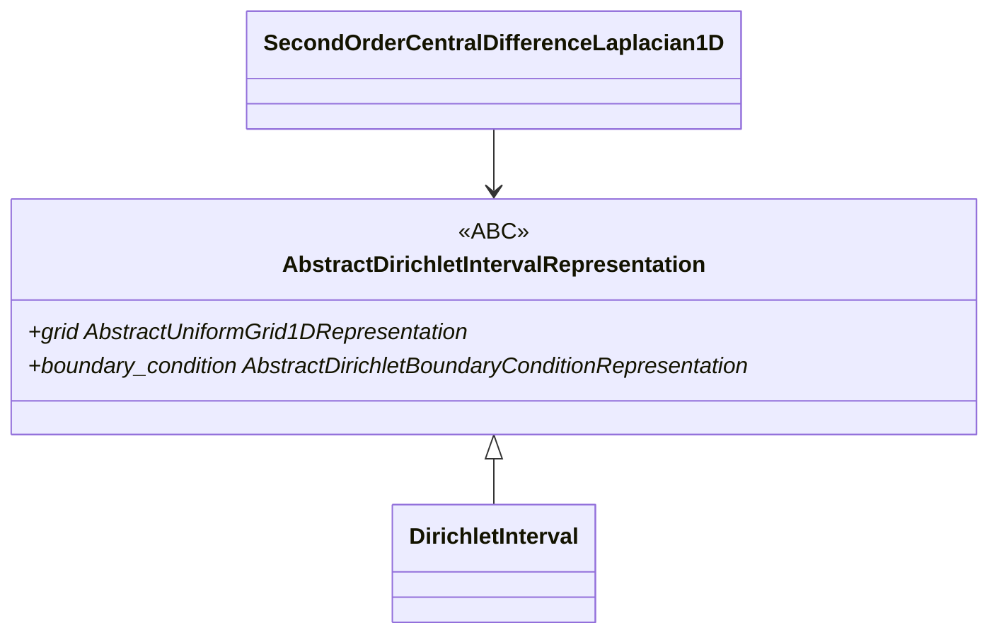

# `AbstractDirichletIntervalRepresentation` schematic

```mermaid
classDiagram
    class AbstractDirichletIntervalRepresentation {
        <<ABC>>
        +grid AbstractUniformGrid1DRepresentation*
        +boundary_condition AbstractDirichletBoundaryConditionRepresentation*
    }
    class DirichletInterval
    class SecondOrderCentralDifferenceLaplacian1D

    AbstractDirichletIntervalRepresentation <|-- DirichletInterval
    SecondOrderCentralDifferenceLaplacian1D --> AbstractDirichletIntervalRepresentation
```
