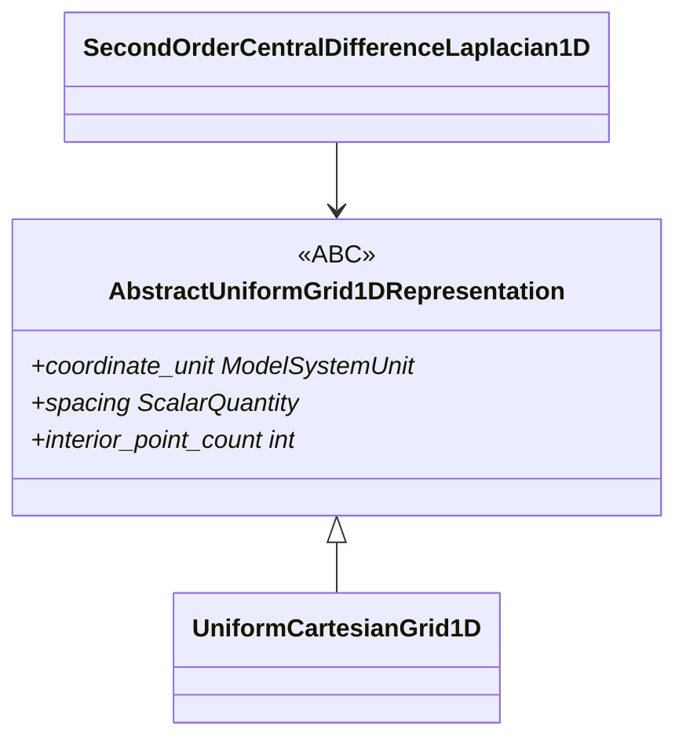

# `AbstractUniformGrid1DRepresentation` schematic

```mermaid
classDiagram
    class AbstractUniformGrid1DRepresentation {
        <<ABC>>
        +coordinate_unit ModelSystemUnit*
        +spacing ScalarQuantity*
        +interior_point_count int*
    }
    class UniformCartesianGrid1D
    class SecondOrderCentralDifferenceLaplacian1D

    AbstractUniformGrid1DRepresentation <|-- UniformCartesianGrid1D
    SecondOrderCentralDifferenceLaplacian1D --> AbstractUniformGrid1DRepresentation
```
