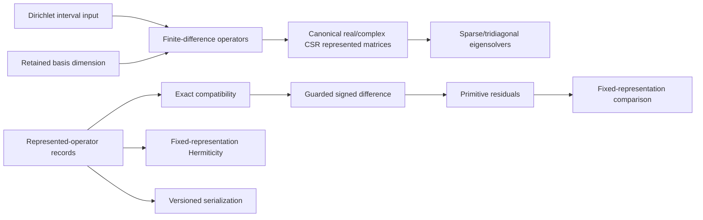

# `ksdft2effmass.operators` package

## Responsibility

`ksdft2effmass.operators` is the cohesive, narrowly bounded owner of finite
represented-operator records and deterministic operations on already identified
representations. It retains:

- state-space, ordered-basis, geometry, energy-reference, matrix, and provenance
  metadata;
- immutable scalar, vector, real or complex dense-matrix, and canonical real or
  complex CSR sparse-matrix quantities plus Pint-backed dimensional compatibility and
  conversion;
- reusable finite retained ladder-operator algebra;
- homogeneous-Dirichlet centered finite-difference Laplacian construction on a
  model-independent interval representation;
- unit-aware Schrödinger kinetic-energy and sampled-potential representations;
- compatible finite-difference Hamiltonian composition;
- complete dense and sparse-tridiagonal real-symmetric eigenpair solution, plus
  iterative lowest-state selection for general sparse symmetric operators;
- retained lowest complex-Hermitian eigenpairs, nondensifying sparse algebraic
  eigenpair-residual analysis, and explicit iterative proper-subset solution for
  canonical sparse Hermitian operators;
- orthogonal spectral-subspace selection and represented-operator compression;
- explicit Frobenius, spectral, and maximum-entry matrix-norm analysis for dense or
  sparse represented matrices;
- strict versioned serialization;
- exact represented-metadata compatibility auditing;
- fixed-representation Hermiticity analysis for complete dense operator records and
  canonical complex CSR matrix quantities;
- guarded signed subtraction for already compatible records;
- primitive maximum-entry, Frobenius, and spectral residual mechanics; and
- narrow composition of differencing and primitive residual analysis.

## Boundary

The package does not select or estimate basis, gauge, geometry, spin, unit, or
energy-reference alignment. Its finite-difference constructors accept already declared
grid, boundary, and physical-quantity inputs and may perform dimensional conversion
needed to construct one represented matrix; they do not select those inputs. The
package does not convert energy zeros, determine physical equivalence, fit model
classes, perform continuum reduction or structured learning, classify a generic
difference as an impurity operator, decide scientific acceptance, or own Workflow
orchestration.

Complex matrix quantities preserve values, units, and explicit dense boundaries, but
do not by themselves identify a complete represented operator. Selected complex
Hermitian eigenvectors are necessarily retained as dense columns, while iterative
solution and algebraic residual evaluation use the canonical sparse operator without
densifying it. The sparse solver rejects complete eigensystems, which require a
separately explicit dense boundary. State-space, basis, geometry, gauge, and energy-reference
metadata remain required before comparison.

A successful compatibility audit establishes only the exact represented prerequisites
it checks. A successful subtraction or residual calculation establishes only its
declared fixed-representation software or numerical contract. Higher-level scientific
analysis consumes this package through the dependency
`ksdft2effmass.analysis → ksdft2effmass.operators`.

## Migration and status

Human-authorized Option A retains the Architecture v1 package owner. The selected
records-disposition plan is a provisional no-change baseline: it leaves
`operators.records`, `operators.serialization`, and `operators.compatibility` in
place, keeps the currently supported `ksdft2effmass.operators` imports and nominal
type identities, and leaves the version-1 specification and golden fixtures
unchanged. It does not freeze the final Architecture v2 scientific API. Controlled
manuscript exercises may identify later state-space, projection, embedding,
comparison, or model-class requirements, but any resulting public-contract change
requires separate authorization and migration evidence. No facade, duplicate record
type, v2 wire, or source cutover is introduced by this planning result. The
higher-level analysis disposition remains with its separate Task. This result changes
no implemented dependency and authorizes no scientific or protected execution.
