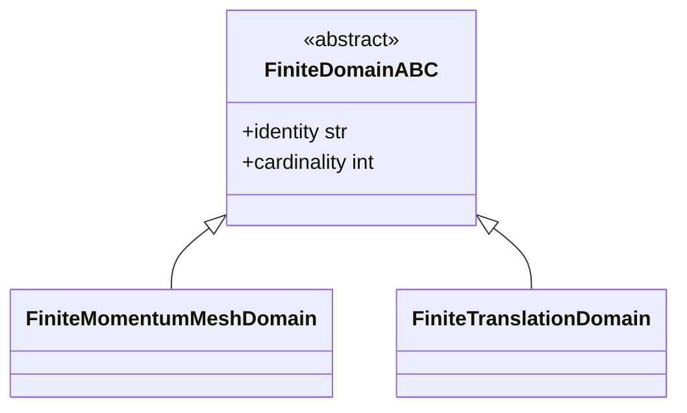
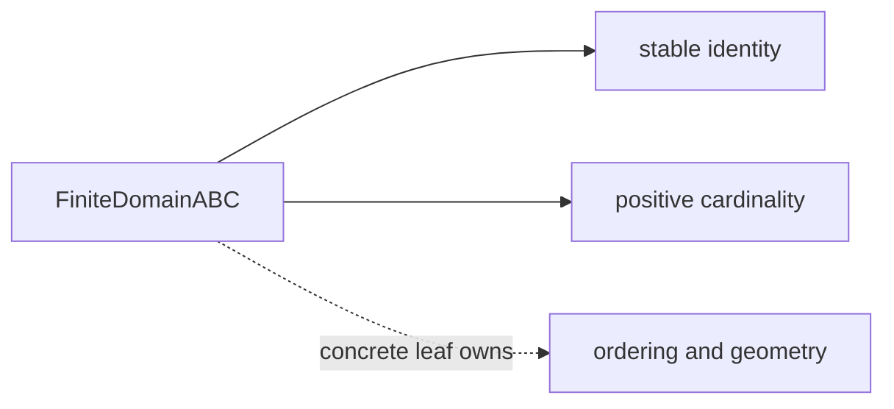

# Schematics

```mermaid
classDiagram
    class FiniteDomainABC {
        <<abstract>>
        +identity str
        +cardinality int
    }
    class FiniteMomentumMeshDomain
    class FiniteTranslationDomain
    FiniteDomainABC <|-- FiniteMomentumMeshDomain
    FiniteDomainABC <|-- FiniteTranslationDomain
```

```mermaid
flowchart LR
    domain["FiniteDomainABC"] --> identity["stable identity"]
    domain --> count["positive cardinality"]
    domain -. "concrete leaf owns" .-> ordering["ordering and geometry"]
```
