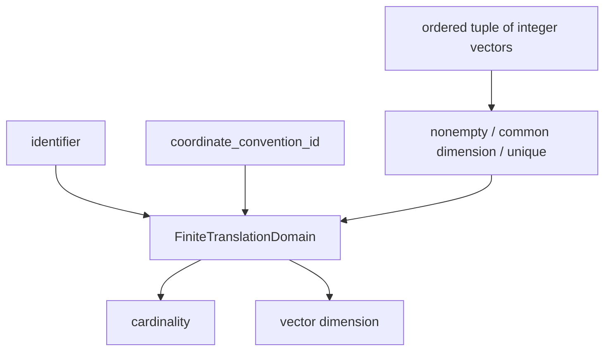
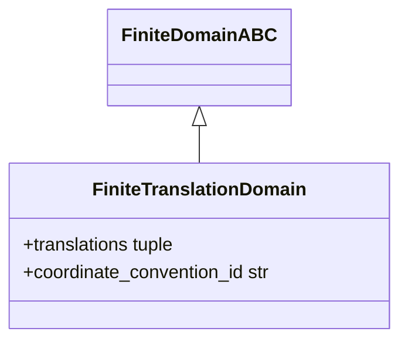

# Schematics

```mermaid
flowchart TD
    id["identifier"] --> domain["FiniteTranslationDomain"]
    vectors["ordered tuple of integer vectors"] --> validate["nonempty / common dimension / unique"]
    convention["coordinate_convention_id"] --> domain
    validate --> domain
    domain --> count["cardinality"]
    domain --> dimension["vector dimension"]
```

```mermaid
classDiagram
    FiniteDomainABC <|-- FiniteTranslationDomain
    FiniteTranslationDomain : +translations tuple
    FiniteTranslationDomain : +coordinate_convention_id str
```
