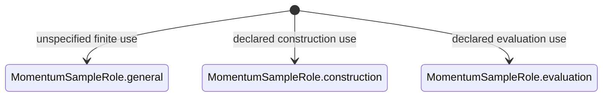
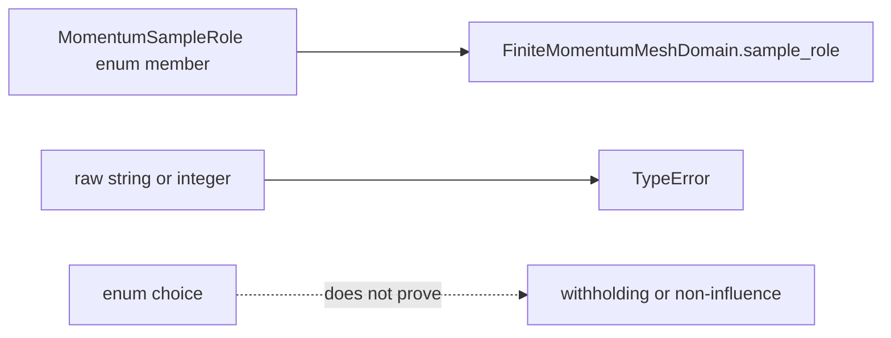

# Schematics

```mermaid
stateDiagram-v2
    state "MomentumSampleRole.general" as general
    state "MomentumSampleRole.construction" as construction
    state "MomentumSampleRole.evaluation" as evaluation

    [*] --> general: unspecified finite use
    [*] --> construction: declared construction use
    [*] --> evaluation: declared evaluation use
```

```mermaid
flowchart LR
    member["MomentumSampleRole enum member"] --> domain["FiniteMomentumMeshDomain.sample_role"]
    raw["raw string or integer"] --> reject["TypeError"]
    role["enum choice"] -. "does not prove" .-> withholding["withholding or non-influence"]
```
