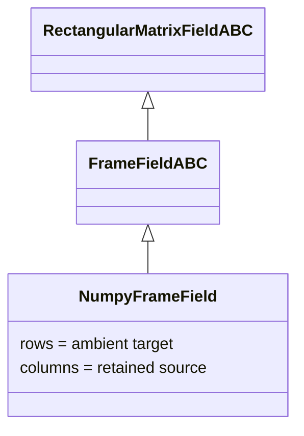

# Schematics

```mermaid
classDiagram
    RectangularMatrixFieldABC <|-- FrameFieldABC
    FrameFieldABC <|-- NumpyFrameField
    NumpyFrameField : rows = ambient target
    NumpyFrameField : columns = retained source
```
