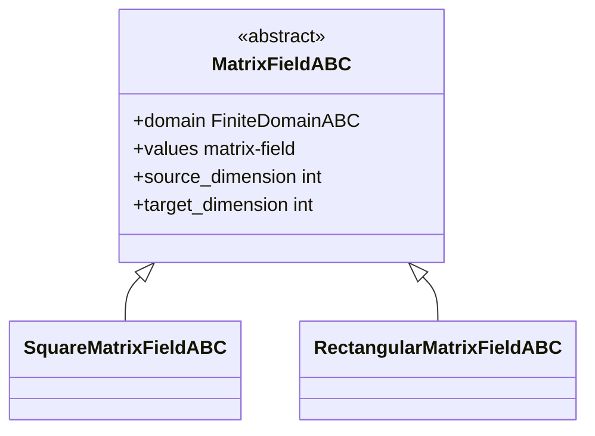
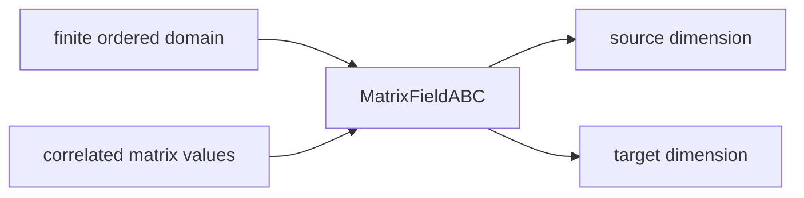

# Schematics

```mermaid
classDiagram
    class MatrixFieldABC {
        <<abstract>>
        +domain FiniteDomainABC
        +values matrix-field
        +source_dimension int
        +target_dimension int
    }
    MatrixFieldABC <|-- SquareMatrixFieldABC
    MatrixFieldABC <|-- RectangularMatrixFieldABC
```

```mermaid
flowchart LR
    domain["finite ordered domain"] --> field["MatrixFieldABC"]
    values["correlated matrix values"] --> field
    field --> source["source dimension"]
    field --> target["target dimension"]
```
