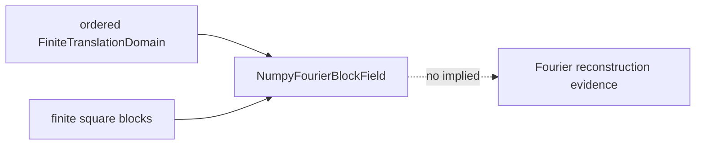

# Schematics

```mermaid
flowchart LR
    translations["ordered FiniteTranslationDomain"] --> field["NumpyFourierBlockField"]
    blocks["finite square blocks"] --> field
    field -. "no implied" .-> reconstruction["Fourier reconstruction evidence"]
```
