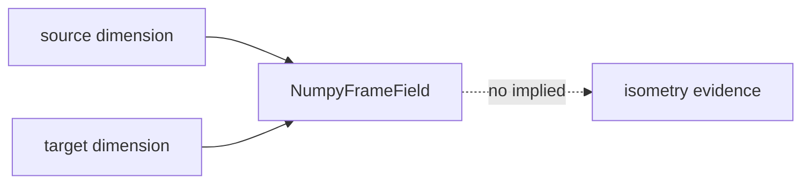

# Schematics

```mermaid
flowchart LR
    retained["source dimension"] --> frame["NumpyFrameField"]
    ambient["target dimension"] --> frame
    frame -. "no implied" .-> isometry["isometry evidence"]
```
