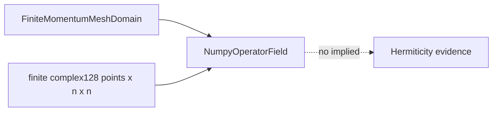

# Schematics

```mermaid
flowchart LR
    domain["FiniteMomentumMeshDomain"] --> field["NumpyOperatorField"]
    values["finite complex128 points x n x n"] --> field
    field -. "no implied" .-> hermitian["Hermiticity evidence"]
```
