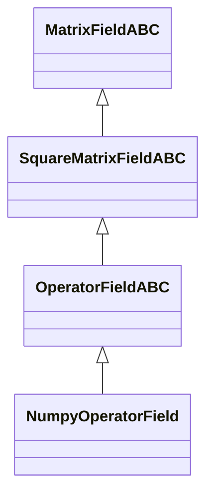
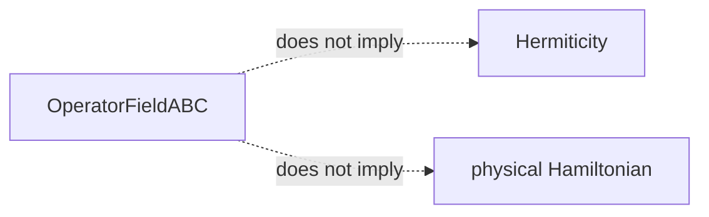

# Schematics

```mermaid
classDiagram
    MatrixFieldABC <|-- SquareMatrixFieldABC
    SquareMatrixFieldABC <|-- OperatorFieldABC
    OperatorFieldABC <|-- NumpyOperatorField
```

```mermaid
flowchart LR
    role["OperatorFieldABC"] -. "does not imply" .-> hermitian["Hermiticity"]
    role -. "does not imply" .-> hamiltonian["physical Hamiltonian"]
```
