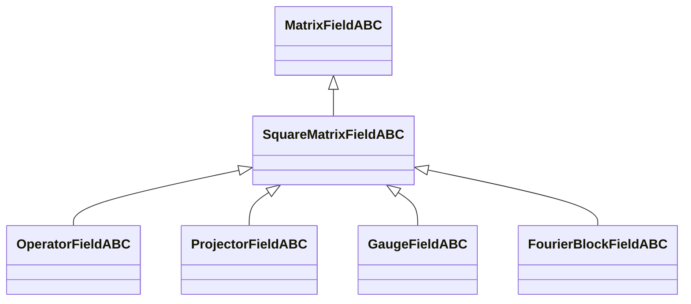
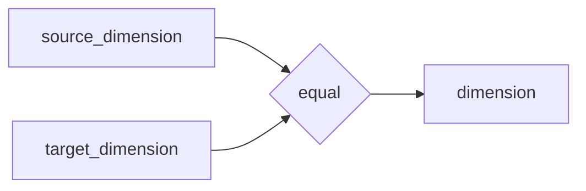

# Schematics

```mermaid
classDiagram
    MatrixFieldABC <|-- SquareMatrixFieldABC
    SquareMatrixFieldABC <|-- OperatorFieldABC
    SquareMatrixFieldABC <|-- ProjectorFieldABC
    SquareMatrixFieldABC <|-- GaugeFieldABC
    SquareMatrixFieldABC <|-- FourierBlockFieldABC
```

```mermaid
flowchart LR
    source["source_dimension"] --> equal{"equal"}
    target["target_dimension"] --> equal
    equal --> dimension["dimension"]
```
