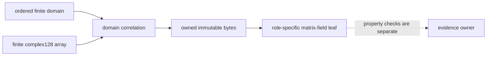

# Schematics

```mermaid
flowchart LR
    domain["ordered finite domain"] --> validate["domain correlation"]
    values["finite complex128 array"] --> validate
    validate --> immutable["owned immutable bytes"]
    immutable --> role["role-specific matrix-field leaf"]
    role -. "property checks are separate" .-> evidence["evidence owner"]
```
