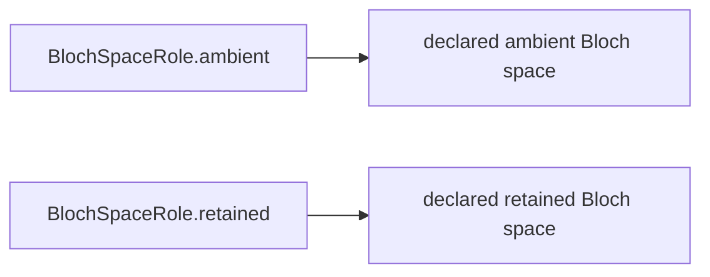
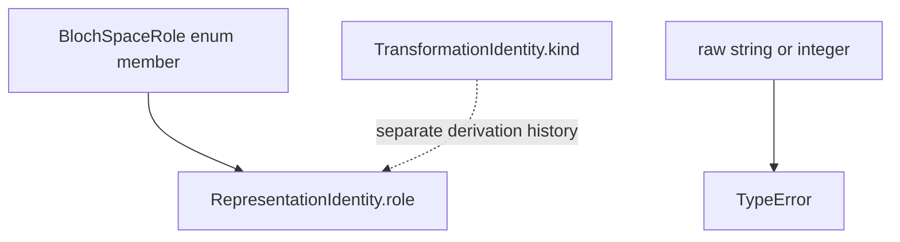

# Schematics

```mermaid
flowchart LR
    ambient["BlochSpaceRole.ambient"] --> parent["declared ambient Bloch space"]
    retained["BlochSpaceRole.retained"] --> retainedSpace["declared retained Bloch space"]
```

```mermaid
flowchart TD
    role["BlochSpaceRole enum member"] --> identity["RepresentationIdentity.role"]
    edge["TransformationIdentity.kind"] -. "separate derivation history" .-> identity
    raw["raw string or integer"] --> reject["TypeError"]
```
