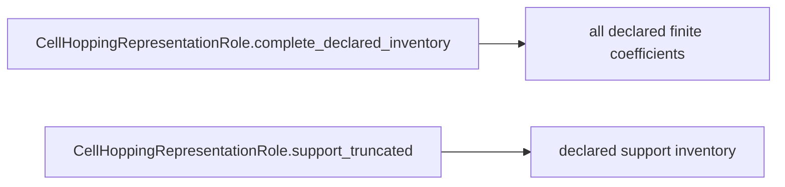
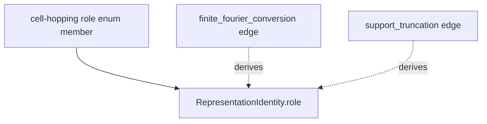

# Schematics

```mermaid
flowchart LR
    complete["CellHoppingRepresentationRole.complete_declared_inventory"] --> inventory["all declared finite coefficients"]
    truncated["CellHoppingRepresentationRole.support_truncated"] --> support["declared support inventory"]
```

```mermaid
flowchart TD
    role["cell-hopping role enum member"] --> identity["RepresentationIdentity.role"]
    conversion["finite_fourier_conversion edge"] -. "derives" .-> identity
    truncation["support_truncation edge"] -. "derives" .-> identity
```
