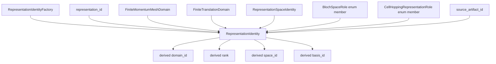
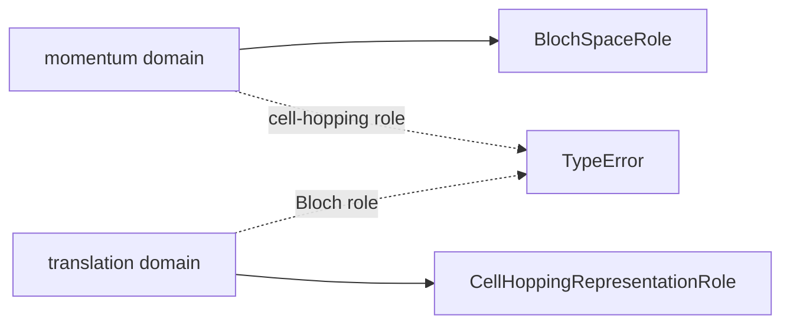

# Schematics

```mermaid
flowchart TD
    factory["RepresentationIdentityFactory"] --> identity["RepresentationIdentity"]
    repId["representation_id"] --> identity
    momentum["FiniteMomentumMeshDomain"] --> identity
    translation["FiniteTranslationDomain"] --> identity
    space["RepresentationSpaceIdentity"] --> identity
    blochRole["BlochSpaceRole enum member"] --> identity
    hoppingRole["CellHoppingRepresentationRole enum member"] --> identity
    source["source_artifact_id"] --> identity
    identity --> domainId["derived domain_id"]
    identity --> rank["derived rank"]
    identity --> spaceId["derived space_id"]
    identity --> basisId["derived basis_id"]
```

```mermaid
flowchart LR
    momentum["momentum domain"] --> bloch["BlochSpaceRole"]
    translation["translation domain"] --> hopping["CellHoppingRepresentationRole"]
    momentum -. "cell-hopping role" .-> reject["TypeError"]
    translation -. "Bloch role" .-> reject
```
