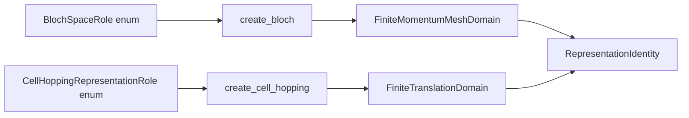
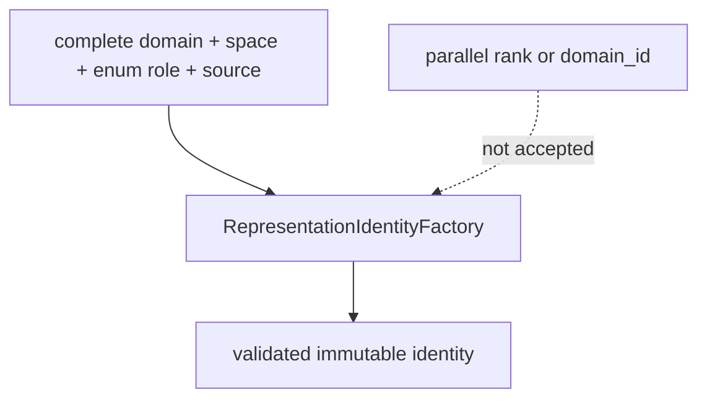

# Schematics

```mermaid
flowchart LR
    blochMethod["create_bloch"] --> momentum["FiniteMomentumMeshDomain"]
    blochRole["BlochSpaceRole enum"] --> blochMethod
    momentum --> identity["RepresentationIdentity"]
    cellMethod["create_cell_hopping"] --> translation["FiniteTranslationDomain"]
    cellRole["CellHoppingRepresentationRole enum"] --> cellMethod
    translation --> identity
```

```mermaid
flowchart TD
    complete["complete domain + space + enum role + source"] --> factory["RepresentationIdentityFactory"]
    factory --> immutable["validated immutable identity"]
    parallel["parallel rank or domain_id"] -. "not accepted" .-> factory
```
