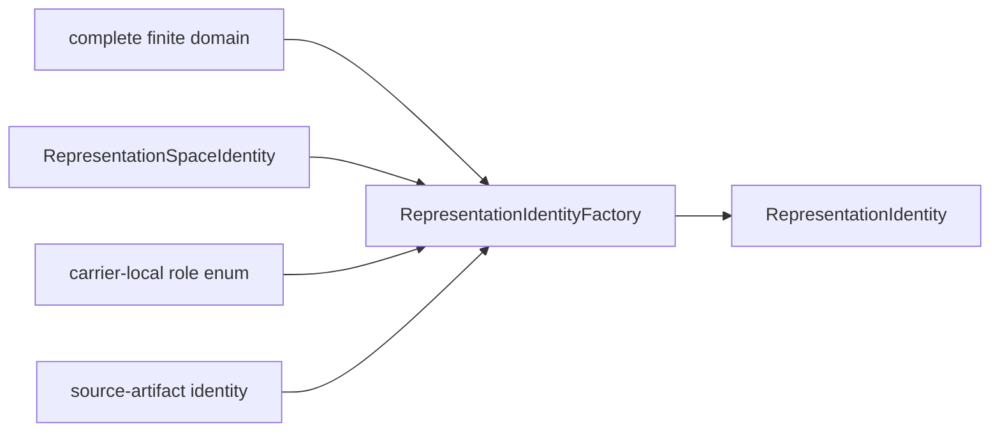
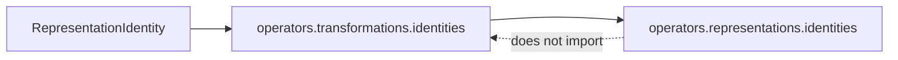

# Schematics

## Node identity construction

```mermaid
flowchart LR
    domain["complete finite domain"] --> nodeFactory["RepresentationIdentityFactory"]
    space["RepresentationSpaceIdentity"] --> nodeFactory
    role["carrier-local role enum"] --> nodeFactory
    source["source-artifact identity"] --> nodeFactory
    nodeFactory --> node["RepresentationIdentity"]
```

## Ownership boundary

```mermaid
flowchart LR
    node["RepresentationIdentity"] --> edgeOwner["operators.transformations.identities"]
    representations["operators.representations.identities"] -. "does not import" .-> edgeOwner
    edgeOwner --> representations
```
